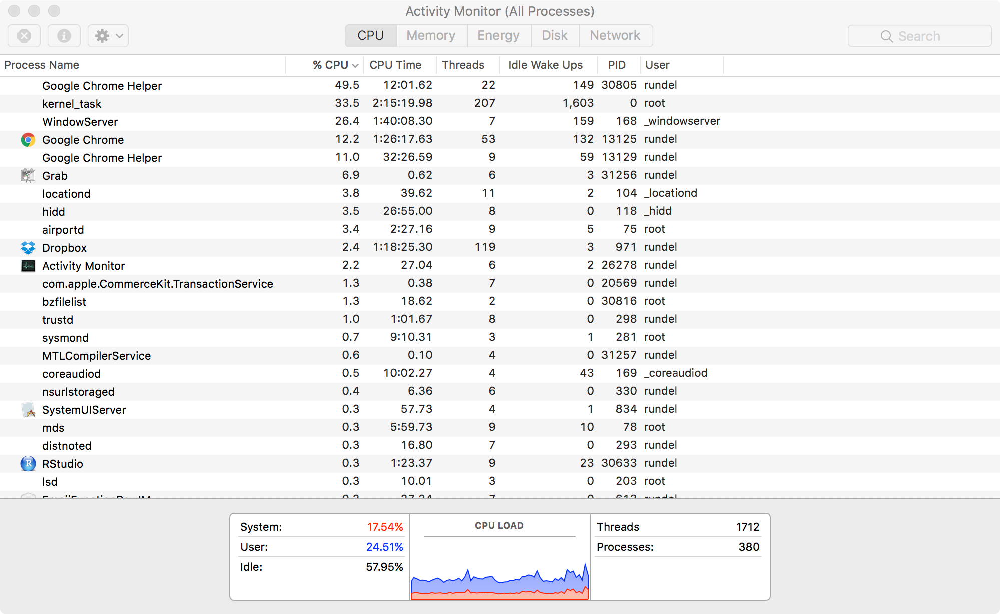

```{r, echo=FALSE, results='hide'}
options(width = 90)
```


# Set up & Configuration

## Datasets, presentation, source code

- The slides, data, and all source files for this presentation can be found at

    - www.stat.duke.edu/~cr173/datafest/df2017/

<br/>

- That data we will be using today is available via the ASA's 2009 Data Expo. The original data set was information on all domestic flights in the US between 1987 and 2008. We will be limiting ourselves to 2008 to keep the data sizes manageable.


## Packages

The following are packages we will be using this evening:

- `dplyr`, `ggplot2`

- `readr`, `data.table`

- `pryr`

- `microbenchmark`, `rbenchmark`, `profvis`


Generally whenever I use a package I will load it before the relevant code.


# Getting data into R

## Know your data (size)

```{r}
file.info(list.files("data",full.names = TRUE))
```

## Reading CSV - Base R

```{r eval=FALSE}
system.time({flights = read.csv("data/2008.csv")})

##   user  system elapsed 
## 89.693   4.299  95.563 
```

```{r eval=FALSE}
system.time({flights = read.csv("data/2008.csv.bz2")})

##    user  system elapsed 
## 179.085   4.487 186.402 
```

```{r eval=FALSE}
system.time({flights = read.csv("data/2008.csv", comment.char="", stringsAsFactors=FALSE)})

##   user  system elapsed 
## 85.795   3.545  90.966 
```

## Reading CSV - Fancy R

```{r eval=FALSE}
library(readr)
system.time({flights = read_csv("data/2008.csv.bz2")})

## |==================================================================================| 100%  657 MB
##    user  system elapsed 
##  56.820  13.262  74.163 
```


```{r message=FALSE}
library(data.table)
system.time({flights = fread("data/2008.csv", showProgress = FALSE)})
```

## Aside - cleaning up `fread`

Some people like `data.table`, others do not. If you *don't* intend to use `data.table` functionality after using fread it is a good idea to fix the class of your object after reading it in.

```{r}
class(flights)

class(flights) = "data.frame"

class(flights)
```


## Aside - Saving R objects

A lot of the difficulty and slowness of reading CSV files comes from trying to figure out what type each column should have. We can save ourselves this trouble later on by saving our data as a binary Rdata file.

```{r eval=FALSE}
save(flights, file="data/flights.Rdata")
system.time(load(file="data/flights.Rdata"))

##   user  system elapsed 
## 10.563   0.399  11.027
```


# A foray into algorithms

## Numbers programmer / everyone should know {.smaller}

| Task                                         | Timing            |
|----------------------------------------------|-------------------|
| L1 cache reference                           | 0.5 ns            |
| L2 cache reference                           | 7 ns              |
| Main memory reference                        | 100 ns            |
| Read 1 MB sequentially from memory           | 250,000 ns        |
| Read 1 MB sequentially from SSD              | 1,000,000  ns     |
| Disk seek                                    | 10,000,000 ns     |
| Read 1 MB sequentially from network          | 10,000,000 ns     |
| Read 1 MB sequentially from spinning disk    | 30,000,000 ns     |
| Send packet CA -> Netherlands -> CA          | 150,000,000 ns    |

<div style="font-size: 10pt">
From: https://gist.github.com/jboner/2841832
</div>


## Implications for bigish data {.smaller}

Lets imagine we have a *10 GB* flat data file and that we want to select certain rows based on a given criteria. This requires a sequential read across the entire data set.


If we can store the file in memory:

* $10~GB \times (250~\mu s / 1~MB) = 2.5$ seconds


If we have to access the file from an SSD:

* $10~GB \times (1~ms / 1~MB) = 10$ seconds


If we have to access the file from a spinning disk:

* $10~GB \times (30~ms / 1~MB) = 300$ seconds

<br/>

This is just for *reading* data, if we make any modifications (*writing*) things are much worse. Also, this is actually incredibly optimistic since it assumes that all the data on disk can be read in one continuous read. 


## Moral of the story
<div class="centered">

</div>

## Practical Advice

The development of databases (e.g. MySQL, Oracle, etc.) was to solve this problem: what do you do when data size >> available memory.

<br/>

- Generally speaking they are a great tool but a bit of overkill for DataFest
 
<br/>
 
- DataFest data is general on the scale of 1-2 GB
  
    - Small enough to fit in memory on most laptops
    
    - Large enough that you need to be careful (many operations will create hidden copys)


## Sampling FTW {.smaller}

A simple but useful trick is to only work with the full data set when you absolutely have to. We are generally interested in the large scale patterns / features of the data and these are generally preserved by randomly sampling that data (this keeps statisticians employed).

```{r message=FALSE}
library(dplyr)
library(pryr)

set.seed(20170330)
flights_sub = flights %>% sample_frac(0.1)
```

<div class="columns-2">
```{r}
object.size(flights)
object_size(flights)
```

```{r}
object.size(flights_sub)
object_size(flights_sub)
```
</div>


## Aside - Deleting Objects

If you are not using the original object it is a good idea to delete it to free up memory (can always read it back in again later).

```{r eval=FALSE}
rm(flights)
gc()

##            used  (Mb) gc trigger   (Mb)  max used   (Mb)
## Ncells  1062473  56.8    1770749   94.6   1770749   94.6
## Vcells 14146350 108.0  258829281 1974.8 577295819 4404.5
```


# Other useful tools

## Progress bars (via dplyr)

Generally we want to avoid for loops, but that isn't always possible. For slow loops it is a good idea to track our progress (and know much time is left).

```{r message=FALSE}
library(dplyr)

p = progress_estimated(50, min_time = 0)
for(i in 1:50)
{
  # Calculate something compliated
  Sys.sleep(0.1)
  
  p$tick()$print()
}
```


## Simple benchmarking

The simplest tool is base R's `system.time` which can be used to wrap any other call or calls.

```{r}
system.time(rnorm(1e6))
system.time(rnorm(1e4) %*% t(rnorm(1e4)))
``` 


## Better benchmarking - `microbenchmark` {.smaller}

We can do better (better precision) using the microbenchmark package 


```{r}
library(microbenchmark)

d = abs(rnorm(1000))
r = microbenchmark(
      exp(log(d)/2),
      d^0.5,
      sqrt(d),
      times = 1000
    )
print(r)
```


##

```{r fig.align="center"}
boxplot(r)
```


## Better benchmarking - `rbenchmark` {.smaller}

We can also use the `rbenchmark` package 

```{r}
library(rbenchmark)

d = abs(rnorm(1000))
benchmark(
  exp(log(d)/2),
  d^0.5,
  sqrt(d),
  replications = 1000,
  order = "relative"
)
```

## Profiling

```{r message=FALSE}
library(profvis)

set.seed(20170330)
flights_small = flights %>% sample_n(100000)
```

```{r eval=FALSE}
profvis({
  m = lm(AirTime ~ Distance, data = flights_small)
  plot(AirTime ~ Distance, data = flights_small)
  abline(m, col = "red")
})
```


# General Advice and <br/> Pearls of Wisdom

## General Advice

- Sample, sample, sample 

    - and also maybe subset (rows *and* columns)

- Save your code and important data objects regularly - bigger data can and will kill your R session 

- If something is taking a long time - kill it and figure out why (or at least how long it will take)

- Vectorized >> `*apply` / `map*` >> `for` / `while`


## What's happening?

Make use of Activity Monitor (OSX) / Task Manager (Windows) to monitor CPU / Memory usage.

<div class="centered">



## Looping {.smaller}

```{r}
for_grow = function(x) {
  res = c()
  for(x_i in x) 
    res = c(res,sqrt(x_i))
  res
}

for_init = function(x) {
  res = rep(NA, length(x))
  for(i in seq_along(x))
    res[i] = sqrt(x[i])
}

vect = function(x) {
  sqrt(x)
}

dplyr_mutate = function(x) {
  data.frame(x=x) %>% mutate(s = sqrt(x))
}

dplyr_transmute = function(x) {
  data.frame(x=x) %>% transmute(s = sqrt(x))
}
```
  

## {.smaller}

```{r eval=FALSE}
library(rbenchmark)

d = abs(rnorm(1000))
benchmark(
  for_grow(d),
  for_init(d),
  vect(d),
  dplyr_mutate(d),
  dplyr_transmute(d),
  replications = 100,
  relative = "elapsed"
) %>% 
  arrange(elapsed) %>% 
  select(test:relative)

##                 test replications elapsed relative
## 1            vect(d)          100   0.001        1
## 2    dplyr_mutate(d)          100   0.077       77
## 3        for_init(d)          100   0.097       97
## 4 dplyr_transmute(d)          100   0.099       99
## 5        for_grow(d)          100   0.290      290
```


## {.smaller}

```{r eval=FALSE}
d = abs(rnorm(10000))
benchmark(
  for_grow(d),
  for_init(d),
  vect(d),
  dplyr_mutate(d),
  dplyr_transmute(d),
  replications = 100,
  relative = "elapsed"
) %>% 
  arrange(elapsed) %>% 
  select(test:relative)

##                 test replications elapsed  relative
## 1            vect(d)          100   0.003     1.000
## 2    dplyr_mutate(d)          100   0.060    20.000
## 3 dplyr_transmute(d)          100   0.090    30.000
## 4        for_init(d)          100   0.862   287.333
## 5        for_grow(d)          100  36.920 12306.667
```


## Plotting {.smaller}

With large data sets overplotting is often a serious issue, 

```{r}
plot(AirTime ~ Distance, data = flights_small)
```

This can be addresseds with transparency (alpha) and plot character sizes (or binning)


## 

```{r}
plot(AirTime ~ Distance, data = flights_small, 
     pch=16, 
     col=adjustcolor("black",alpha.f=0.01),
     cex=0.5)
```

##

```{r warning=FALSE}
library(ggplot2)
ggplot(flights_small, aes(y=AirTime,x=Distance)) +
  geom_point(alpha=0.01, size=0.5)
```


##

```{r warning=FALSE}
ggplot(flights_small, aes(y=AirTime,x=Distance)) +
  geom_hex()
```

##

```{r warning=FALSE}
ggplot(flights_small, aes(y=AirTime,x=Distance)) +
  geom_hex(aes(fill=sqrt(..count..)))
```

##

```{r warning=FALSE}
ggplot(flights_small, aes(y=AirTime,x=Distance)) +
  geom_hex(aes(fill=log(..count..)))
```

##

```{r warning=FALSE}
ggplot(flights_small, aes(y=AirTime,x=Distance)) +
  geom_point(data=sample_n(flights,100)) +
  geom_density_2d(alpha=0.5) 
```


## PDF Graphics

PDF and other SVG type plots are useful because you can adjust the scale and zoom, but when there are many many plot objects they can be painfully slow. For these cases consider creating an image (fixed resolution) based plot (e.g. png) instead.

```{r eval=FALSE,warning=FALSE}
png("time_vs_dist.png", width=1024, height=800)
ggplot(flights_small, aes(y=AirTime,x=Distance)) +
  geom_point(alpha=0.01, size=0.5)
dev.off()
```


## Merging data {.smaller}

The different parts of the raw data or any additional outside data you find may need to be merged together. This can be down with dplyr's join functions or base R's merge - but it important to think about the nature of the relationship between the two data sets.

<br/>

- **One to one** - each entry in `A` corresponds to either 0 or 1 entries in `B`

<br/>

- **One to many** or **many to one** - each entry in `A` corresponds to 0 or more entries in `B`, or vice versa.

<br/>

- **Many to many** - each entry in `A` corresponds to  0 or more entries in `B` *and* each entry in `B` corresponds to 0 or more entries in `A`.


## Why many to many merges are problematic {.smaller}

```{r}
addr = data.frame(name = c("Alice","Alice", "Bob","Bob"),
                  email= c("alice@company.com","alice@gmail.com",
                           "bob@company.com","bob@hotmail.com"),
                  stringsAsFactors = FALSE)

phone = data.frame(name = c("Alice","Alice", "Bob","Bob"),
                   phone= c("919 555-1111", "310 555-2222", 
                            "919 555-3333", "310 555-3333"),
                   stringsAsFactors = FALSE)

library(dplyr)
full_join(addr, phone, by="name")
```

## Really really problematic {.smaller}

```{r}
A = data.frame(common="C", A_values=1:1000)
B = data.frame(common="C", B_values=1:1000)

inner_join(A,B) %>% tbl_df()
```


## A brief note on algorithmic complexity {.smaller}

Some advice given by Mark Suchard at UCLA (unsure of who said this originally)

<br/>

- **Linear complexity** $(\mathcal{O}(n))$ - Great

    - Examples: Vectorized `sqrt`, `lm`

<br/>

- **Quadratic complexity** $(\mathcal{O}(n^2))$ - Pray

    - Examples: Bubble sort, `dist`

<br/>

- **Cubic complexity** $(\mathcal{O}(n^3))$ - Give up

    - Examples: `%*%`, `solve`, `chol`

