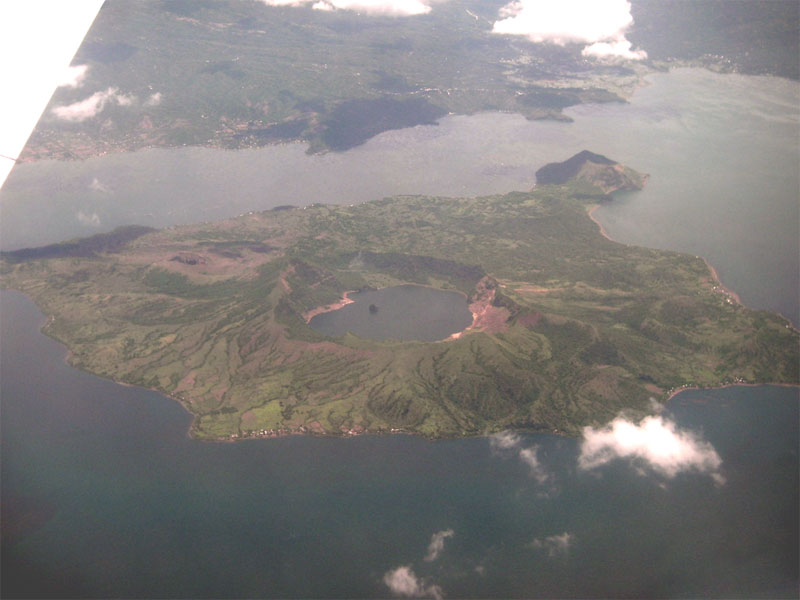
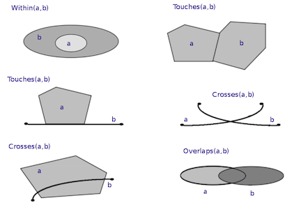

# Background

## Analysis of geospatial data in R {.smaller}

R has a rich package ecosystem for read/writing, manipulating, and analyzing geospatial data.

<br/>

Some core packages:

* `sp` - core classes for handling spatial data, additional utility functions.

* `rgdal` - R interface to `gdal` (Geospatial Data Abstraction Library) for reading and writing spatial data.

* `maptools` - Additional tools for reading and writing spatial data.

* `rgeos` - R interface to `geos` (Geometry Engine Open Source) library for querying and manipulating spatial data. Reading and writing WKT.

* `raster` - classes and tools for handling spatial raster data.

<br/>

See more - [Spatial task view](http://cran.r-project.org/web/views/Spatial.html)


## Taxonomy of geospatial objects (Simple Features) {.smaller}

```{r, echo=FALSE, results='hide'}
suppressMessages(library(rgeos, quietly=TRUE, warn.conflicts=FALSE))
suppressMessages(library(rgdal, quietly=TRUE, warn.conflicts=FALSE))
suppressMessages(library(sp, quietly=TRUE, warn.conflicts=FALSE))
suppressMessages(library(maptools, quietly=TRUE, warn.conflicts=FALSE))

poly_coords = function(sp)
{
  do.call(rbind,
          lapply(sp@polygons,
                 function(p)
                    do.call(rbind, lapply(p@Polygons,
                                          function(P)
                                            coordinates(P)
                                         )
                    )
          )
  )
}
```


```{r, echo=FALSE, out.width="1000px", out.height="500px"}
par(mar=c(1,1,2,1), mfrow=c(2,4))

## Point
sp = readWKT('POINT (30 10)')
plot(sp, axes=FALSE, main="Point", pch=16)
points(coordinates(sp), pch=16)
box()

## Linestring
sp = readWKT('LINESTRING (30 10, 10 30, 40 40)')
plot(sp, axes=FALSE, main="Linestring")
r=rapply(coordinates(sp), points, pch=16)
box()

## Polygon
sp = readWKT('POLYGON ((30 10, 40 40, 20 40, 10 20, 30 10))')
plot(sp, axes=FALSE, col="lightgrey", main="Polygon")
points(poly_coords(sp), pch=16)
box()

## Polygon with Hole
sp = readWKT('POLYGON ((35 10, 45 45, 15 40, 10 20, 35 10),
              (20 30, 35 35, 30 20, 20 30))')
plot(sp, axes=FALSE, col="lightgrey", main="Polygon w/ Hole(s)")
points(poly_coords(sp), pch=16)
box()


## MultiPoint
sp = readWKT('MULTIPOINT ((10 40), (40 30), (20 20), (30 10))')
plot(sp, axes=FALSE, pch=16, main="Multi Point")
points(coordinates(sp), pch=16)
box()

## MultiLineString
sp = readWKT('MULTILINESTRING ((10 10, 20 20, 10 40),
                    (40 40, 30 30, 40 20, 30 10))')
plot(sp, axes=FALSE, main="Multi Linestring")
r=rapply(coordinates(sp), points, pch=16)
box()


## MultiPolygon
sp = readWKT('MULTIPOLYGON (((30 20, 45 40, 10 40, 30 20)),
                   ((15 5, 40 10, 10 20, 5 10, 15 5)))')
plot(sp, axes=FALSE, col="lightgrey", main="Multi Polygon")
points(poly_coords(sp), pch=16)
box()

## MultiPolygon with Hole(s)
sp = readWKT('MULTIPOLYGON (((40 40, 20 45, 45 30, 40 40)),
                   ((20 35, 10 30, 10 10, 30 5, 45 20, 20 35),
                    (30 20, 20 15, 20 25, 30 20)))')
plot(sp, axes=FALSE, col="lightgrey", main="Multi Polygon w/ Hole(s)")
points(poly_coords(sp), pch=16)
box()
```


## Geometry Collection {.smaller}

```{r, echo=FALSE, fig.align='center', out.width='800px'}
par(mar=c(1,1,1,1))

cols = c("#7fc97f","#386cb0","#beaed4","#fdc086")

pt   = readWKT('POINT (3 3)')
mpt  = readWKT('MULTIPOINT ((4 8), (1 8))')
mls  = readWKT('MULTILINESTRING ((4 6,7 10), (1 1,1 2,2 2))')
poly = readWKT('POLYGON ((6 6, 8 6, 8 8, 6 6))')
plot(0, 0, type='n', axes=FALSE, xlim=c(0,9),ylim=c(0,11),xlab="",ylab="", main="")
box()

plot(pt, add=TRUE, pch=16, col=cols[1], cex=1.5)

plot(mpt, add=TRUE, pch=16, col=cols[2], cex=1.5)

plot(mls, add=TRUE, col=cols[3], lwd=2)
r=rapply(coordinates(mls), points, pch=16, col=cols[3], cex=1.5)

plot(poly, add=TRUE, col=paste0(cols[4],"CC"),lwd=2,border=cols[4])
points(poly_coords(poly), pch=16, col=paste0(cols[4],"CC"),cex=1.5)
```

## R and Simple Feature Access {.smaller}

The R package `sp` provides classes that implement these geospatial objects.

<br/>

|                 | Point(s)                 | Linestring(s)           | Polygon(s)                 | Geometry Collection             |
|:---------------:|--------------------------|-------------------------|----------------------------|:-------------------------------:|
|    Geometry     | `SpatialPoints`          | `SpatialLines`          | `SpatialPolygons`          | `SpatialCollection`*            |
| Geometry + Data | `SpatialPointsDataFrame` | `SpatialLinesDataFrame` | `SpatialPolygonsDataFrame` | ---                             |

<br/>

They also handle additional tasks like tracking the projection of the spatial coordinates.

```{r echo=FALSE, results='hide'}
data(wrld_simpl)
NAm = wrld_simpl[wrld_simpl$FIPS %in% c("CA","GL","MX","US"),]
NAm_google = spTransform(NAm, CRS("+init=epsg:3857"))
```

## Reading and writing geospatial data via `sp`

- `maptools`:
    * `readShapePoints` / `writeShapePoints` - Shapefile w/ points
    * `readShapeLines` / `writeShapeLines` - Shapefile w/ lines
    * `readShapePoly` / `writeShapePoly` - Shapefile w/ polygons
    * `readShapeSpatial` / `writeShapeSpatial` - Shapefile
- `rgdal`:
    * `readOGR` / `writeOGR` - Shapefile, GeoJSON, KML, ...
- `rgeos`:
    * `readWKT` / `writeWKT` - Well Known Text

<!--
## Geospatial object details {.smaller}

<div class="columns-2">
```{r}
ogrInfo("data/ak/",layer="states")
```
```{r}
ogrInfo("data/us_interstates/","us_interstates")
```
<br/><br/><br/><br/>
</div>
-->

# Geospatial stuff is hard

## Projections

```{r echo=FALSE, out.width="1000px", out.height="500px", fig.align="center"}
par(mar=c(3,2,2,1),mfrow=c(1,2))
plot(NAm, col="black", border=adjustcolor("black",alpha=0),
     main="Lat/Long (epsg:4326)", xlim=c(-180,-10), axes=TRUE)
box()

plot(NAm_google, col="black", border=adjustcolor("black",alpha=0),
     main="Google (epsg:3857)", axes=TRUE, xlim=c(-2e7,0), ylim=c(0,2e7))
box()
```

## Dateline

Want to fly from the Western most point in the US to the Eastern most point?


```{r echo=FALSE, fig.align="center", fig.height=4, fig.width=10}
par(mar=c(3,3,1,1))
ak = readOGR("data/ak/states.shp","states",FALSE)

for(i in 1:length(ak@polygons[[1]]@Polygons))
{
    p = ak@polygons[[1]]@Polygons[[i]]@coords
    p[p[,1] > 0,1] = -360 + p[p[,1] > 0,1]
    ak@polygons[[1]]@Polygons[[i]]@coords = p
}

plot(ak, col="black", xlim=c(-170,-190), ylim=c(51,53),axes=TRUE)
points(c(-360+179.776,-179.146), c(51.952,51.273),col='red')
abline(v=-180,col='blue',lty=2)
```

##

```{r echo=FALSE}
library(geosphere)
par(mar=c(0,0,0,0))
```

```{r fig.align="center", fig.width=10, fig.height=4.5}
inter = gcIntermediate(c(179.776,51.952), c(-179.146,51.273), n=50, addStartEnd=TRUE)

plot(wrld_simpl, col="black", ylim=c(15,90))
lines(inter,col='red',lwd=2,lty=3)
```

## Relationships



## Distance

```{r echo=FALSE, fig.align="center"}
pt = readWKT("MULTIPOINT ((45 43), (15 70))")
ls = readWKT("LINESTRING (10 10, 10 90)")
po = readWKT("POLYGON ((30 50, 50 80, 70 50, 50 20, 30 50), (40 40, 60 40, 60 60, 40 60, 40 40))")

par(mar=c(0,0,0,0))
plot(0,0, type='n', axes=FALSE, xlab="", ylab="", xlim=c(0,90),ylim=c(0,90))


plot(pt, add=TRUE, pch=16, col=cols[1], cex=1.5)
text(48,50,"C",cex=3,col=cols[1])
text(18,77,"C",cex=3,col=cols[1])

plot(ls, add=TRUE, col=cols[3], lwd=2)
r=rapply(coordinates(ls), points, pch=16, col=cols[3], cex=1.5)
text(5,50,"B",cex=3,col=cols[3])

plot(po, add=TRUE, col=paste0(cols[4],"CC"),lwd=2,border=cols[4])
points(poly_coords(po), pch=16, col=paste0(cols[4],"CC"),cex=1.5)
text(35,70,"A",cex=3,col=paste0(cols[4],"CC"))
```

How do we define the distance between A and B, A and C, or B and C?


# GIS Functionality

## Example data

```{r}
nc  = readOGR("data/nc_counties/","nc_counties",FALSE)
air = readOGR("data/airports/","airports",FALSE)
hwy = readOGR("data/us_interstates/","us_interstates",FALSE)

proj4string(nc)
proj4string(air)
proj4string(hwy)
```

##
```{r echo=FALSE}
par(mar=c(0,0,0,0))
```

```{r fig.align="center"}
nc = spTransform(nc, CRS(proj4string(hwy)))
row.names(nc) = sub(" County","", as.character(nc$COUNTY))
air = spTransform(air, CRS(proj4string(hwy)))

plot(nc)
plot(air, add=TRUE, pch=1, col="blue")
plot(hwy, add=TRUE, col="red")
```

## Distance to the closest airport from each county? {.smaller}

```{r}
d = gDistance(nc,air,byid=c(TRUE,FALSE)) 
str(d)
```
<div class="columns-2">
```{r}
d[,"Durham"]
d[,"Wake"]
d[,"Orange"]
```

<br/><br/><br/>
</div>

## Distance to County centroid? {.smaller}

```{r}
ncc = gCentroid(nc,byid=TRUE)
class(ncc)
d = gDistance(ncc,air,byid=c(TRUE,FALSE)) 
```

<div class="columns-2">
```{r}
d[,"Durham"]
d[,"Wake"]
d[,"Orange"]
```

<br/><br/><br/>
</div>

## Spatial predicates in `rgeos` {.smaller}



<br/>

<div class="centered">
For more detail see the DE-9IM specification
</div>

## Which counties have airports? {.smaller}

```{r}
nc_air = gIntersects(nc,air,byid=c(TRUE)) 
str(nc_air)
nc$COUNTY[apply(nc_air,2,any)]
```

##

```{r fig.align="center"}
plot(nc)
plot(nc[apply(nc_air,2,any),], add=TRUE, col="lightblue")
plot(air[apply(nc_air,1,any),], add=TRUE, pch=1, col="blue")
```

<!--
## Which interstates cross NC?

```{r}
nc_hwy = gIntersects(nc,hwy,byid=c(FALSE,TRUE)) 
hwy$ROUTE_NUM[nc_hwy]
```
-->

## Adjacency matrix of counties {.smaller}

```{r}
adj = gTouches(nc,byid=TRUE)
str(adj)
nc$COUNTY[adj["Durham",]]
```

## {.smaller}

```{r fig.align="center"}
library(corrplot)
corrplot(adj[1:20,1:20],method="color",type="lower",tl.col="black",cl.pos = "n")
```

## Which counties have the most neighbors?

```{r fig.align="center"}
plot(nc)
plot(nc[rowSums(adj)==max(rowSums(adj)),],add=TRUE,col="lightblue")
```

## Which counties have the least neighbors?

```{r fig.align="center"}
plot(nc)
plot(nc[rowSums(adj)==min(rowSums(adj)),],add=TRUE,col="lightblue")
```


# Conclusion

## Summary

- Geospatial stuff can be hard ... but it doesn't have to be
    * Don't reinvent the wheel
    * Open standards are your friend
    * High quality open source libraries 

<br/>

- Keep calm, use R

    * Built on the same standards compliant libraries
    * Open source with a vibrant and growing package ecosystem
    * Reproducibility via scriptability
    * Unification of workflow

## 

<br/><br/>

<div class="centered">
<div style="font-size:300%;">
Questions & Comments?
</div>
</div>

<br/><br/><br/>

|--------------|:-:|-------------------------|
| email        |   | rundel@gmail.com        |
| github       |   | http://github.com/rundel|
| presentation |   | http://bit.ly/1MCKNzK   |
