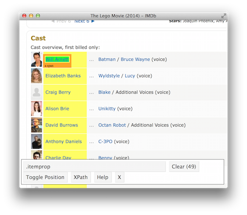

exclude: true

```{r, message=FALSE, warning=FALSE, include=FALSE}
options(
  htmltools.dir.version = FALSE, # for blogdown
  width = 100,
  tibble.width = 100
)

library(dplyr)
library(purrr)
library(rvest)
library(jsonlite)
```

---
class: center, middle, inverse, title-slide

# Tidying Hierarchical Data from the Web

### Colin Rundel <br/> 2018-11-13

.lower-left-corner[ .small[ 
[http://bit.ly/Rundel-DVS](http://bit.ly/Rundel-DVS)
] ]


---
class: middle
count: false

# Getting Started

---

## R environments

We will be going through several live demos today and I will be making my code available as we go via a Dropbox link. 

It will likely be most useful for you to follow along by taking this code as it is produced and copying and pasting it to your own R session.

* For this to work well please make sure that you are running a reasonable current version of R (3.5.1 is the latest). 

* If you can't or don't want to update your local install, I highly recommend: 

    * [https://vm-manage.oit.duke.edu/containers](https://vm-manage.oit.duke.edu/containers)

---

## Packages

Everythign we are going to use today is either part of or a dependency of the `tidyverse` metapackage. If you don't have that installed, now would be good to do so. (It is better to do it now since installation can take awhile)

```{r eval = FALSE}
install.packages("tidyverse")
```

Additionally, even if you do have it installed now is also a good time to check that all of your packages are up-to-date.

```{r eval = FALSE}
update.packages()
```

---

## My sessionInfo

```{r}
sessioninfo::package_info() %>% .[.$attached,]
```

---
class: middle
count: false

# Hierarchical Data?

---

## Web data - html

```html
<html>
  <body>
  
    <div>
      <span class="title">The Cat in the Hat</span>
      by <span class="author">Dr. Seuss</span>
      -  <span class="price">$6.99</span>
    </div>
    
    <div>
      <span class="title">Edgar Gets Ready for Bed</span>
      by <span class="author">Jennifer Adams</span>, 
         <span class="author">Ron Stucki</span>
      -  <span class="price">$9.99</span>
    </div>
    
    <div>
      <span class="title">"More More More", Said the Baby</span>
      by <span class="author">Vera B Williams</span>
      -  <span class="price">$7.19</span>
    </div>

  </body>
</html>
```

---

## Web data - JSON

```json
{
  "bookList": [
    {
      "title": "The Cat in the Hat",
      "author": "Dr. Seuss",
      "price": 6.99
    },
    {
      "title": "Edgar Gets Ready for Bed",
      "author": ["Jennifer Adams", "Ron Stucki"],
      "price": 9.99
    },
    {
      "title": "\"More More More\", Said the Baby",
      "author": "Vera B Williams",
      "price": 7.19
    }
  ]
}
```

---

## Web data - XML

```xml
<bookList>
  <book>
    <title>The Cat in the Hat</title>
    <author>Dr. Seuss</author>
    <price>6.99</price>
  </book>
  <book>
    <title>Edgar Gets Ready for Bed</title>
    <author>Jennifer Adams and Ron Stucki</author>
    <price>9.99</price>
  </book>
  <book>
    <title>"More More More," Said the Baby</title>
    <author>Vera B Williams</author>
    <price>7.19</price>
  </book>
</bookList>
```

---

## Tidy data

```{r echo=FALSE, out.width="100%"}
knitr::include_graphics('imgs/tidy.png')
```

.footnote[ 
From R4DS - [tidy data chapter](r4ds.had.co.nz/tidy-data.html), [J. Stat Soft Paper (2014)](http://www.jstatsoft.org/v59/i10/)
]

---
class: middle
count: false

# Motivating Examples

---

background-image: url(imgs/dennys_lq.jpeg)
background-position: center
background-color: #000000

---

background-image: url(imgs/dark_sky_api.png)
background-color: #30334A
background-position: top

---
class: middle
count: false

# Web Scraping

---

## rvest

.pull-left13[
```{r echo=FALSE}
knitr::include_graphics("imgs/rvest.png")
```
]

.pull-right23[
`rvest` is a tidyverse package that makes basic processing and manipulation of HTML data straight forward. It wraps core functionality from the `xml2` package with a more user friendly interface, as such it can also be used for processing XML data.
]

<br/>

Core functions:

<div>
.pull-left[
* `read_html`
* `html_nodes`
* `html_table`
* `html_text`
]

.pull-right[
* `html_name`
* `html_attrs`
* `html_attr`
]

---

## html + rvest

```html
<html>
  <head>
    <title>This is a title</title>
  </head>
  <body>
    <p align="center">Hello world!</p>
    <br/>
    <div class="name" id="first">John</div>
    <div class="name" id="last">Doe</div>
    <div class="contact">
      <div class="home">555-555-1234</div>
      <div class="home">555-555-2345</div>
      <div class="work">555-555-9999</div>
      <div class="fax">555-555-8888</div>
    </div>
  </body>
</html>
```

```{r echo=FALSE}
html = '
<html>
  <head>
    <title>This is a title</title>
  </head>
  <body>
    <p align="center">Hello world!</p>
    <br/>
    <div class="name" id="first">John</div>
    <div class="name" id="last">Doe</div>
    <div class="contact">
      <div class="home">555-555-1234</div>
      <div class="home">555-555-2345</div>
      <div class="work">555-555-9999</div>
      <div class="fax">555-555-8888</div>
    </div>
  </body>
</html>'
```

```{r}
read_html(html)
```

---

## css selectors

We will be using a tool called **Selector Gadget** to help identify and extract the html elements / attributes of interest - it does this by interactively constructing a css selector using an example html document.

<br/>

.small[

Selector          |  Example         | Description
:-----------------|:-----------------|:--------------------------------------------------
element           |  `p`             | Select all &lt;p&gt; elements
element element   |  `div p`         | Select all &lt;p&gt; elements inside a &lt;div&gt; element
element>element   |  `div > p`       | Select all &lt;p&gt; elements with &lt;div&gt; as a parent
.class            |  `.title`        | Select all elements with class="title" attribute
#id               |  `#name`         | Select all elements with id="name" attribute
[attribute]       |  `[class]`       | Select all elements with a class attribute
[attribute=value] |  `[class=title]` | Select all elements with class="title"

]

---

## Selecting and Extracting

.small[
```html
...
<p align="center">Hello world!</p>
...
```
]


```{r}
read_html(html) %>% html_nodes("p")
```

--

```{r}
read_html(html) %>% html_nodes("p") %>% html_text()
```

--

```{r}
read_html(html) %>% html_nodes("p") %>% html_attrs()
```

--

```{r}
read_html(html) %>% html_nodes("p") %>% html_attr("align")
```

---

## Nesting

.small[
```html
<html>
  <head>
    <title>This is a title</title>
  </head>
  <body>
    <p align="center">Hello world!</p>
    <br/>
    <div class="name" id="first">John</div>
    <div class="name" id="last">Doe</div>
    <div class="contact">
      <div class="home">555-555-1234</div>
      <div class="home">555-555-2345</div>
      <div class="work">555-555-9999</div>
      <div class="fax">555-555-8888</div>
    </div>
  </body>
</html>
```
]


```{r}
read_html(html) %>% html_nodes("body div")
```

---

## Nesting

.small[
```html
<html>
  <head>
    <title>This is a title</title>
  </head>
  <body>
    <p align="center">Hello world!</p>
    <br/>
    <div class="name" id="first">John</div>
    <div class="name" id="last">Doe</div>
    <div class="contact">
      <div class="home">555-555-1234</div>
      <div class="home">555-555-2345</div>
      <div class="work">555-555-9999</div>
      <div class="fax">555-555-8888</div>
    </div>
  </body>
</html>
```
]

```{r}
read_html(html) %>% html_nodes("body>div")
```

---

## Nesting

.small[
```html
<html>
  <head>
    <title>This is a title</title>
  </head>
  <body>
    <p align="center">Hello world!</p>
    <br/>
    <div class="name" id="first">John</div>
    <div class="name" id="last">Doe</div>
    <div class="contact">
      <div class="home">555-555-1234</div>
      <div class="home">555-555-2345</div>
      <div class="work">555-555-9999</div>
      <div class="fax">555-555-8888</div>
    </div>
  </body>
</html>
```
]

```{r}
read_html(html) %>% html_nodes("body div div")
```

---

## classes and ids

```{r}
read_html(html) %>% html_nodes(".name")
```

--


```{r}
read_html(html) %>% html_nodes("div.name")
```

--

```{r}
read_html(html) %>% html_nodes("#first")
```

---

## SelectorGadget

Is a javascript scriptlet / Chrome extension that helps you interactively build a CSS selector for the content you are interested in.

<center>
 <br/>
<a href='http://selectorgadget.com/'>http://selectorgadget.com/</a>
</center>

---
class: middle

.center[
# Live Demo

## Putting `rvest` and `Selector Gadget` to work

#### [http://bit.ly/Rundel-DVS_dennys](http://bit.ly/Rundel-DVS_dennys)
]

---

class: middle
count: false

# Dark Sky API

---

## Dark Sky API Details

Go to https://darksky.net/dev and sign up for an account.

Every account gets up to 1000 free API calls / day which should be more than enough for our purposed today.

--

This API uses a **Re**presentational **S**tate **T**ransfer (REST) design, we can make two kinds of requests with this API.


* Forecast Request:
```url
https://api.darksky.net/forecast/{key}/{latitude},{longitude}
```

* Time Machine Request:
```url
https://api.darksky.net/forecast/{key}/{latitude},{longitude},{time}
```

---

## Durham Forecast results

The latitude and longitude of Durham, NC are 35.9940° N, 78.8986° W which means we need to request 
.small[https://api.darksky.net/forecast/24e13b35a014e3ca53a36a217243f61d/35.9940,-78.8986] <br/>
from the API.

--

The results look something like the following, where each `⊕` represents hidden nested values.
.small[
```json
{  
  "latitude":35.994,
  "longitude":-78.8986,
  "timezone":"America/New_York",
  "currently":{ ⊕ },
  "minutely":{ ⊕ },
  "hourly":{ ⊕  },
  "daily":{ ⊕ },
  "flags":{ ⊕ },
  "offset":-5
}
```
]

.footnote[Note - We can check our coordinates using google maps: https://www.google.com/maps?q=35.9940,-78.8986]

---

## jsonlite

To get things into R we can use the `jsonlite` package to directly read the url.

```{r}
durham = jsonlite::fromJSON(
  "https://api.darksky.net/forecast/24e13b35a014e3ca53a36a217243f61d/35.9940,-78.8986",
  simplifyDataFrame = FALSE
)
```

```{r}
str(durham)
```

---

## Complex `list`s - `str`

.pull-left[
```{r}
str(durham, max.level=1)
```
]

.pull-right[
```{r}
str(durham$currently, max.level=1)
```
]

---

## Complex `list`s - `View`

```{r eval=FALSE}
View(durham)
```

.pull-left[
```{r echo=FALSE}

```
]

.pull-right[
```{r echo=FALSE}

```
]


---

## purrr

.pull-left13[
```{r echo=FALSE}
knitr::include_graphics("imgs/purrr.png")
```
]

.pull-right23[
`purrr` is a tidyverse package which improves the functional programming tools in R (i.e. `lapply`, `sapply`, etc.). It focuses on providing *pure* and *type stable* functions as well as several convenient shortcuts for common tasks.
]

--

<br/>

Key functions:

<div>
.pull-left[
* `map()`

* `map_lgl()`

* `map_int()`

* `map_dbl()`
]

.pull-right[
* `map_chr()`

* `map_df()` / `map_dfr()`

* `map_dfc()`

* `walk()`
]
</div>

---

## Type Consistency

R is a weakly / dynamically typed language which means there is no simple way to define a function which enforces the argument or return types of a function.

This flexibility can be useful at times, but often it makes it hard to reason about your code and requires more verbose code to handle edge cases.

.small[
```{r}
x = list(1:3, 4:6, 7:9)
```

.pull-left[
```{r error=TRUE}
sapply(x, mean)
lapply(x, mean)
```
]

.pull-right[
```{r error=TRUE}
map_dbl(x, mean)
map_chr(x, mean)
map_int(x, mean)
```
] ]

---

## Purrr shortcut - Lookups

Very often we want to extract only certain (named) values from a list, `purrr` provides a shortcut for this operation by providing either a character or numeric value instead of a function to the `map` function.

.small[

.pull-left[
```{r}
json = jsonlite::fromJSON(
'{
  "bookList": [
    {"title": "The Cat in the Hat",
     "author": "Dr. Seuss",
     "price": 6.99},
    {"title": "Edgar Gets Ready for Bed",
     "author": ["Jennifer Adams", "Ron Stucki"],
     "price": 9.99},
    {"title": "\\"More More More\\", Said the Baby",
     "author": "Vera B Williams",
     "price": 7.19}
  ]
}', simplifyVector = FALSE
)
```
]

.pull-right[
```{r}
str(json)
```
]
]


---

## Purrr shortcut - Lookups

```{r error=TRUE}
map_chr(json$bookList, "title")
```

--

```{r error=TRUE}
map_dbl(json$bookList, "price")
```

--

```{r error=TRUE}
map_chr(json$bookList, "author")
```

--

```{r error=TRUE}
map_chr(json$bookList, list("author", 1))
```

---
class: middle

.center[
# Live Demo

## Putting `purrr` to work

#### [http://bit.ly/Rundel-DVS_darksky](http://bit.ly/Rundel-DVS_darksky)
]

