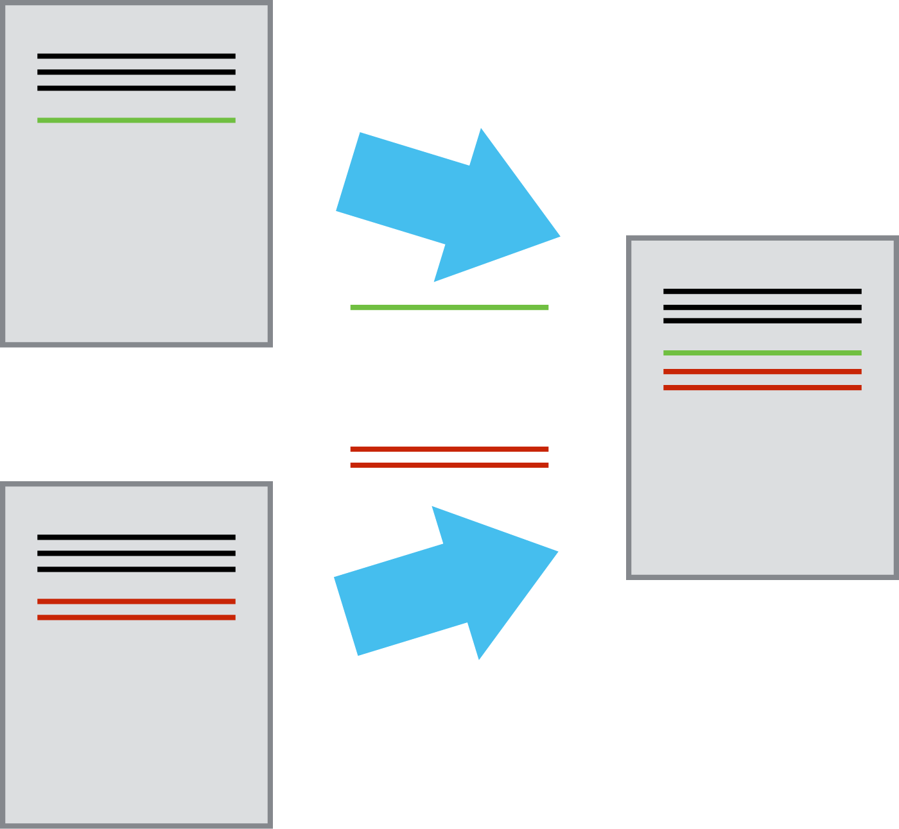

exclude: true

```{r setup, message=FALSE, warning=FALSE, include=FALSE}
knitr::opts_chunk$set(cache = TRUE)

#old_hooks = fansi::set_knit_hooks(knitr::knit_hooks)
#options(crayon.enabled = TRUE)

library(ghclass)
library(dplyr)
```

```{r cleanup, include = FALSE}
repo_delete(org_repos("ghclass-demo"), prompt = FALSE)
team_delete("ghclass-demo", org_teams("ghclass-demo"), prompt = FALSE)
org_remove("ghclass-demo", org_members("ghclass-demo", include_admins = FALSE), prompt = FALSE)
```

```{r student_pats, include = FALSE}
enc = readRDS("~/Desktop/Projects/ghclass/credentials/example_users.enc.rds")
key = sodium::sha256(charToRaw(Sys.getenv("GHCLASS_PAT")))
pats = unserialize( sodium::data_decrypt(enc, key) )
```

```{r add_students, include = FALSE}
user = c("ghclass-anya", "ghclass-bruno", "ghclass-celine", "ghclass-diego")
ghclass::org_invite(org = "ghclass-demo", user = user)
ghclass:::org_accept_invite("ghclass-demo", names(pats)[1:4], pats[1:4])
```

---
class: title_bg

.title[
Using git and GitHub in the Classroom
]

.conference[
  .name[ 
    ECME, April 2020 
  ]
  .bitly[ 
    
  ] 
]

.author[
.name[
Colin Rundel
]
.school[
Univ of Edinburgh
]
]

---
class: middle, center

## Teaching Reproducible Workflows

---

## Reproducible vs Replicable

```{r echo=FALSE, out.width="50%", fig.align="center"}

```

.footnote[
Source: Patil, Peng, Leek (2019) A visual tool for defining reproducibility and replicability. <i>Nature Human Behaviour</i>
]

---

## Reproducibility as a trust scale

<br/><br/>

```{r echo=FALSE, out.width="100%", fig.align="center"}

```

<br/><br/><br/>

.footnote[
Source: Gabriel Becker - <a href="https://gmbecker.github.io/MayInstituteKeynote2019/outline.html">Keynote</a> - Advanced R Course - May Institute for Computational Proteomics 2019
]

---

## Reproducibility details

<br/>

- Are the tables and figures reproducible from the code and data?

- Does the code actually do what you think it does?

- In addition to what was done, is it clear *why* it was done? (e.g. how were hyper / tuning parameters chosen?)

- Can the code be used for other data?

- Can you extend the code to do other things?

---

## Reproducibility Toolchain

<br/>

.larger[ .center[
Scriptability $\rightarrow$ R <br/> <br/>
] ]

--

.larger[ .center[
Literate programming $\rightarrow$ R Markdown <br/> <br/>
] ]

--

.larger[ .center[
Version control $\rightarrow$ `git` / GitHub <br/> <br/>
] ]

---
class: middle, center

## Version Control

---

## What is version control?

Version control is a (formal) system that records changes to a file (or a set of files) over time so that you can retrieve specific versions later.

---

## Minimal Version Control

```{r echo=FALSE, out.width="40%", fig.align="center"}
knitr::include_graphics("imgs/phd_comics_vc.gif")
```

.footnote[
Source: [Piled Higher and Deeper](http://www.phdcomics.com) by Jorge Cham
]

---

## Version control systems

- Start with a initial version of a document / file.

- When you "save" just record the pieces of the file that changed.

```{r echo=FALSE, out.width="25%", fig.align="center"}
knitr::include_graphics("imgs/play-changes.png")
```

- This creates a timeline for each and every file being tracked that lets you move backwards and forwards in time by adding or removing these diffs.

- "Playing back" different sets of diffs onto the original document allows for multiple versions of any file to exist at the same time.

```{r echo=FALSE, out.width="15%", fig.align="center"}

```

.footnote[
Source: [Software Carpentry](https://software-carpentry.org/).
]

---

## git

> Git is a distributed version-control system for tracking changes in source code during software development. It is designed for coordinating work among programmers, but it can be used to track changes in any set of files. Its goals include speed, data integrity, and support for distributed, non-linear workflows.


.footnote[
Source: Wikipedia - [git](https://en.wikipedia.org/wiki/Git).
]

---

## git in practice

```{r echo=FALSE, out.width="49%"}

```
```{r echo=FALSE, out.width="49%"}

```

.footnote[
https://github.com/pcottle/learnGitBranching
]

---

## GitHub

```{r echo=FALSE, out.width="100%"}

```

---
class: center,  middle

# Some Terminology

---

## Repository (Repo)

```{r echo=FALSE, out.width="100%", fig.align="center"}

```

---

## History

```{r echo=FALSE, out.width="100%", fig.align="center"}

```

---

## Commit

```{r echo=FALSE, out.width="100%", fig.align="center"}

```

---
class: center, middle

# In the classroom

---

## Context

* Last semester I was the course organizer for Math 11176 - Statistical Programming
  * MSc course w/ ~200 students enrolled

* Multiple marked assignments (both individual and team based)

* For each assignment we distribute:
  * Instruction document
  * Template `Rmd` for solutions
  * Data and other support files
  
* Need to collect: 
  * Completed template `Rmd`
  * Rendered output (`pdf`, `html`, `md`, etc.) 

---

## GitHub Structure

* 1 organization / course

* Students are added as (anonymous) members of the organization

* 1 template repo / assignment

* 1 private repo / assignment / (team | individual)

* Automate the distribution, collection, and feedback using GitHub's API

---

## Template Example - hw1

```{r echo=FALSE, out.width="100%", fig.align="center"}

```

---
class: center, middle

## Using `ghclass`

---

## Creating a team assignment

```{r assignment}
org_create_assignment(
  org = "ghclass-demo", 
  repo = c("hw01-team01", "hw01-team01", "hw01-team02", "hw01-team02"),
  user = c("ghclass-anya", "ghclass-bruno", "ghclass-celine", "ghclass-diego"),
  team = c("hw01-team01", "hw01-team01", "hw01-team02", "hw01-team02"),
  source_repo = "statprog-s1-2019/hw1"
)
```

.footnote[
[demo](https://github.com/ghclass-demo/hw01-team01)
]
---

## Creating an individual assignments

```{r exam}
user = c("ghclass-anya", "ghclass-bruno", "ghclass-celine", "ghclass-diego")

org_create_assignment(
  org = "ghclass-demo", 
  repo = paste0("proj1-", user),
  user = user,
  source_repo = "statprog-s1-2019/proj1"
)
```

.footnote[
[demo](https://github.com/ghclass-demo/proj1-ghclass-anya)
]
---

## Update files

```{r add_file}
repo_add_file(repo = org_repos(org = "ghclass-demo", filter = "hw01-"),
              file = "files/fizzbuzz.png", overwrite = TRUE)

repo_add_file(repo = org_repos(org = "ghclass-demo", filter = "hw01-"),
              file = "files/data.csv", overwrite = TRUE)
```

.footnote[
[demo](https://github.com/ghclass-demo/hw01-team01)
]

---

## Collect student work

```{r clean-clone, include=FALSE}
unlink("hw01", recursive = TRUE)
```

```{r clone}
local_repo_clone(repo = org_repos(org = "ghclass-demo", "hw01-"), 
                 local_path = "hw01")
```

--

```{r echo=FALSE, out.width="65%", fig.align="center"}
knitr::include_graphics("imgs/github_clone.png")
```

---

## Contributor statistics

```{r contribs}
repo_contributors(repo = "statprog-s1-2019/hw02-lab01-team03") %>% 
  mutate(username = LETTERS[1:4]) %>%
  arrange(desc(commits))

repo_contributors(repo = "statprog-s1-2019/hw02-lab01-team10") %>%
  mutate(username = 1:5) %>%
  arrange(desc(commits))
```


---
class: middle, center

## GitHub Actions

```{r include=FALSE}
repo_add_badge(c("ghclass-demo/hw01-team01", "ghclass-demo/hw01-team02"))
```

.footnote[
[demo](http://github.com/ghclass-demo/hw01-team01)
]

---
background-image: url("imgs/github_badge.png")
background-position: center
background-size: contain

---
background-image: url("imgs/github_actions_result.png")
background-position: center
background-size: contain

---
background-image: url("imgs/github_actions.png")
background-position: center
background-size: contain

---

## Ongoing and future work

* Peer evaluation (Mine and Therese Anders)

* Processes for rendering / running assignments

* Automated report generation / assignment dashboards

  * Structured assignments
  
  * Code similarity + academic integrity