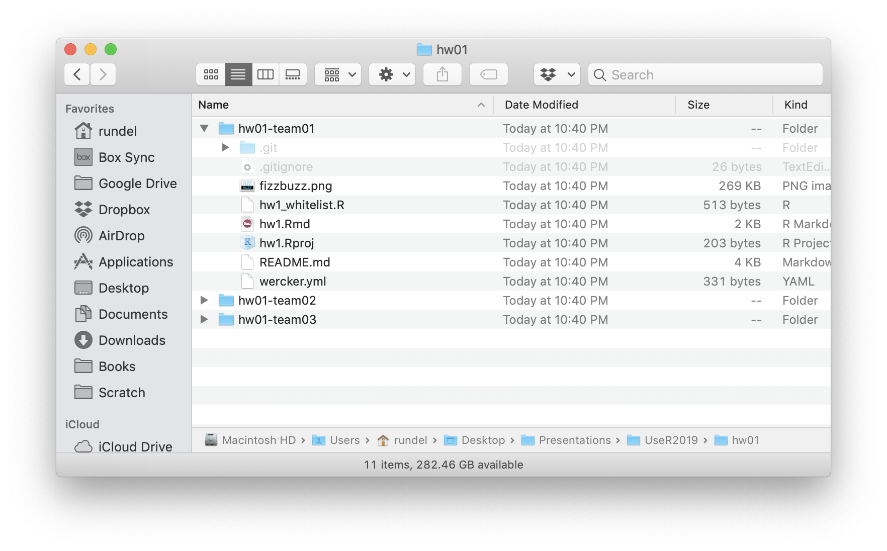

exclude: true

```{r setup, message=FALSE, warning=FALSE, include=FALSE}
fansi::set_knit_hooks(knitr::knit_hooks)
options(crayon.enabled = TRUE)

knitr::opts_chunk$set(cache = TRUE)

library(ghclass)
library(dplyr)
```

```{r cleanup, include = FALSE}
repo_delete(org_repos("ghclass-demo"), prompt = FALSE)
team_delete("ghclass-demo", org_teams("ghclass-demo"), prompt = FALSE)
org_remove("ghclass-demo", org_members("ghclass-demo", include_admins = FALSE), prompt = FALSE)
unlink("hw01/", TRUE, TRUE)
```

```{r student_pats, include = FALSE}
enc = readRDS("~/Desktop/Projects/ghclass/credentials/example_users.enc.rds")
key = sodium::sha256(charToRaw(Sys.getenv("GHCLASS_PAT")))
pats = unserialize( sodium::data_decrypt(enc, key) )
```

---
class: title_bg

.title[
ghclass
]

.subtitle[
an R package for managing classes with GitHub
]


.conference[
.name[
EdinbR 2019
]
.bitly[
[bit.ly/EdinbR2019_ghclass](http://bit.ly/EdinbR2019_ghclass)
]
]

.author[
.name[
Colin Rundel
]
.school[
Univ of Edinburgh
]
]

---

## Background

* I am a Lecturer at University of Edinburgh, School of Mathematics
  * Statistics and Data Science
  * Technology Enhanced Mathematics Education
  
* Teaching Statistical Computing since 2014
  * Reproducible computing / research skills
  * R w/ RStudio (server) + RMarkdown
  * git w/ GitHub

---

## Context

* This semester I am the course organizer for Math 11176 - Statistical Programming
  * MSc course w/ ~200 students enrolled

* Multiple marked assignments (both individual and team based)

* For each assignment we distribute:
  * Instruction document
  * Template `Rmd` for solutions
  * Data and other support files
  
* Need to collect: 
  * Completed template `Rmd`
  * Knit output (`pdf`, `html`, `md`, etc.) 

---

## Setup

1. Signup for a GitHub Account - [github.com]()

2. Setup git and get a GitHub personal access token (PAT) - [github.com/settings/tokens](https://github.com/settings/tokens)
  - Need help? Read [usethis setup vignette](https://usethis.r-lib.org/articles/articles/usethis-setup.html) or [happy git with R](https://happygitwithr.com/)
  - Check config with `usethis::git_sitrep()` and `ghclass::github_test_token()`

3. Signup for the GitHub Education Discount - [education.github.com/benefits](https://education.github.com/benefits)

4. Create a GitHub Organization for your class - [github.com/organizations/new](https://github.com/organizations/new)

5. Invite students to join the Organization

<br/>

.center[
Only step 4 & 5 must be repeated for a new class!
]

---


## Introduction to `ghclass`

```{r fake_install, eval = FALSE}
remotes::install_github("rundel/ghclass")
library(ghclass)
```

--

<br/>

Some design principals behind this package:

1. All of the package's functions are prefixed with either `org`, `repo`, `team`, `github` or `local_repo` to indicate what they operate on.

2. Most functions are vectorized over their parameters, allows related operations to be grouped.

3. Most actions are non-destructive and/or backed by git, the handful of dangerous operations will warn you.

4. Follow the unix design philosophy when possible, work towards simple & composable functions

---

## Org & Roster

Today we will be using [ghclass-demo](https://github.com/ghclass-demo) as our example, hopefully your Organization has a slightly more informative name .

--

.center[
(I find `course`-`when` works well, e.g. `statprog-s1-2019`).
]

--

<br/><br/>

```{r roster, message = FALSE}
(roster = readr::read_csv("files/roster.csv"))
```

---
background-image: url("imgs/01_github_empty.png")
background-position: center
background-size: contain

---

## Inviting Students

```{r invite}
org_invite(org = "ghclass-demo", user = roster$github)
```

--

```{r status1-1}
org_members(org = "ghclass-demo", include_admins = FALSE)
```

```{r status1-2}
org_pending(org = "ghclass-demo")
```

---
background-image: url("imgs/02_github_members.png")
background-position: center
background-size: contain

---
background-image: url("imgs/03_github_pending.png")
background-position: center
background-size: contain

---

## A few days later ...

```{r accept1, include = FALSE}
ghclass:::org_accept_invite("ghclass-demo", names(pats)[1:4], pats[1:4])
```

```{r status2-1}
org_members("ghclass-demo", include_admins = FALSE)
```

```{r status2-2}
org_pending("ghclass-demo")
```

--

## several emails and a week later  ...

```{r accept2, include = FALSE}
ghclass:::org_accept_invite(org = "ghclass-demo", names(pats)[5:6], pats[5:6])
```

```{r status3-1}
org_members(org = "ghclass-demo", include_admins = FALSE)
```

--

```{r status3-2}
org_pending("ghclass-demo")
```

---

## Lets create an team assignment

```{r assignment}
org_create_assignment(
  org = "ghclass-demo", 
  repo = roster$hw01, 
  user = roster$github, 
  team = roster$hw01, 
  source_repo = "statprog-s1-2019/hw1"
)
```

---

## Now an individual assignments

```{r exam}
org_create_assignment(
  org = "ghclass-demo", 
  repo = paste0("proj1-", roster$github),
  user = roster$github,
  source_repo = "statprog-s1-2019/proj1"
)
```

---

## Fixing a file

```{r add_file}
repo_add_file(repo = org_repos(org = "ghclass-demo", filter = "hw01-"),
              file = "files/fizzbuzz.png")
```

--

```{r add_file2}
repo_add_file(repo = org_repos(org = "ghclass-demo", filter = "hw01-"),
              file = "files/fizzbuzz.png", overwrite = TRUE)
```

---

## Modify a file

```{r modify_file}
(contact = roster %>%
  transmute(
    repo = paste0("ghclass-demo/", hw01),
    email = glue::glue("* {name} - [{email}](mailto:{email})")
  ) %>%
  group_by(repo) %>%
  summarize(emails = paste(email, collapse = "\n") %>% paste0("\n\n\n", .)))

repo_modify_file(
  repo = contact$repo, 
  path = "README.md",
  pattern = "Friday, October 4th", 
  content = contact$emails,
  method = "after"
)
```

---
background-image: url("imgs/github_mod.png")
background-position: center
background-size: contain


---

## Collect student work

```{r clone}
local_repo_clone(repo = org_repos(org = "ghclass-demo", "hw01-"), local_path = "hw01")
```

--

```{r echo=FALSE, out.width="65%", fig.align="center"}

```

```{r clean-clone, include=FALSE}
unlink("hw01", recursive = TRUE)
```


---

## Feedback?

```{r student_code, include=FALSE}
repo_add_file(repo = "ghclass-demo/hw01-team01", file = "files/hw1.Rmd", overwrite = TRUE)
```

```{r style}
repo_style(repo = "ghclass-demo/hw01-team01", files = "*.Rmd", draft = TRUE, prompt = FALSE)
```

---
background-image: url("imgs/13_github_pull_req.png")
background-position: center
background-size: contain

---
background-image: url("imgs/14_github_diff.png")
background-position: center
background-size: contain

---

## GitHub Actions

```{r badges}
repo_add_badge(org_repos(org = "ghclass-demo", filter = "hw01-"), workflow = "Check Repo")
```

---
background-image: url("imgs/github_badge.png")
background-position: center
background-size: contain

---
background-image: url("imgs/github_actions_result.png")
background-position: center
background-size: contain

---
background-image: url("imgs/github_actions.png")
background-position: center
background-size: contain


---

## Repo statistics

```{r repo_stats}
org_repo_stats(org = "tidyverse", filter = "tidy", inc_prs = FALSE)
```

.footnote[
Currently only in the `repo_stats` branch
]

---

## Contributor statistics

```{r contribs}
repo_contributors(repo = "tidyverse/dplyr") %>% arrange(desc(commits))
```

.footnote[
Currently only in the `repo_stats` branch
]

---

## Future Work

* We will be submitting to CRAN ~~in the next month~~ soon

* More support for GitHub actions for automated feedback

* Migrate more internals to use the V4 GraphQL API

* Support more workflows, if you GitHub based workflow for teaching that was not reflected here please get in touch.

---

# Thank you!

<br/>

.middle[ .center[

<div style="width: 98%">
<table class="contact" style="text-align: left; font-size: 120%; margin-left:auto; margin-right:auto; width:50%;">
<tbody>
<tr>
  <td style="vertical-align: middle;"> <i class="fas fa-box fa-fw fa-2x"></i> </td>
  <td> 
    <a href="https://github.com/rundel/ghclass">rundel/ghclass</a>
  </td>
</tr>
<tr><td><br/></td></tr>
<tr>
  <td style="vertical-align: middle;"> <i class="far fa-file-powerpoint fa-fw fa-2x"></i> </td>
  <td> 
      <a href="http://bit.ly/EdinbR2019_ghclass">bit.ly/EdinbR2019_ghclass</a>
  </td>
</tr>
<tr><td><br/></td></tr>
<tr>
  <td style="vertical-align: middle;"> <i class="fab fa-github-square fa-fw fa-2x"></i> </td>
  <td> 
    <a href="https://github.com/rundel">github.com/rundel</a>
  </td>
</tr>
<tr><td><br/></td></tr>
<tr>
  <td style="vertical-align: middle;"> <i class="fas fa-envelope fa-fw fa-2x"></i> </td>
  <td> 
    <a href="mailto:rundel@gmail.com">rundel@gmail.com</a>
  </td>
</tr>
<tr><td><br/></td></tr>
<tr>
  <td style="vertical-align: middle;"> <i class="fab fa-twitter-square fa-fw fa-2x"></i> </td>
  <td> 
    <a href="https://twitter.com/rundel">@rundel</a>
  </td>
</tr>
</tbody>
</table>
</div>
] ]
