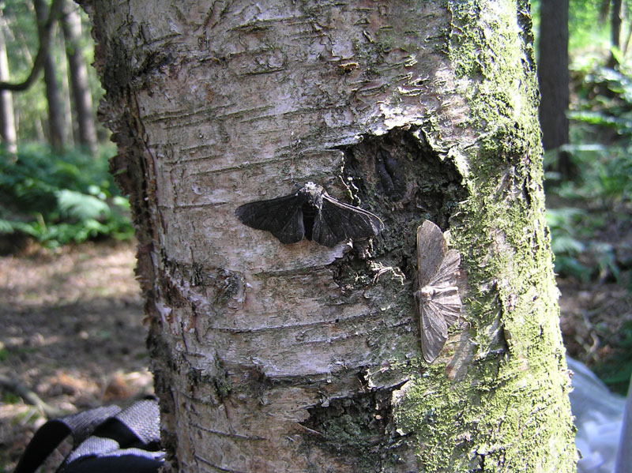

exclude: true

```{r, message=FALSE, warning=FALSE, include=FALSE}
options(
  htmltools.dir.version = FALSE, # for blogdown
  width = 80,
  tibble.width = 80
)

library(magrittr)
library(ggplot2)
library(dplyr)
```


---

## Melanism in Peppered Moths

.pull-left[
```{r echo=FALSE}


```
]

.pull-right[
* *Biston betularia* is a common and widely spread (Asia, Europe, & N. America) species of moth

* The species exhibits several different naturally occurring (and genetically determined) colorations

    - The lightly colored (above) is referred to as *typica*
    
    - The darkly colored (below) is referred to as *carbonaria*
    
* Put forward as an example of evolution by natural selection (different predation rates)
]

.footnote[
Photos by [Olaf Leillinger](https://de.wikipedia.org/wiki/User:olei) via [Wikipedia](https://en.wikipedia.org/wiki/Peppered_moth_evolution).
]

---



.footnote[
Photo by [Martinowksy](https://nl.wikipedia.org/wiki/User:Martinowksy) via [Wikipedia](https://en.wikipedia.org/wiki/Peppered_moth_evolution).
]

---

## Example

Assume that a researcher is interested in understanding the different rates of predation under differing environmental conditions. As a pilot study, they contaminate a small aviary with soot by burning coal and then releasing a large but equal number of *typica* and *carbonaria* peppered moths into the enclosure. 

After several days, the researcher then introduces a small number of insectivorous birds (known to eat the moths) into the aviary.

Finally, after two days of exposure to the predators the research returns to the aviary and collects a sample of the remaining moths. Within their sample they find:

.center[
| Form         | Count |
|:-------------|-------|
| *typica*     |  12   |
| *carbonaria* |  31   |
]

---

## A data model

Is there a simple probabilistic model that we can use to represent the generative process for these data?

<br/>

--

What if instead of moths in an aviary we instead thought of marbles in an urn?

<br/>

--


Based on our model choice, what is the parameter of interest? What does its value tell us in the context of the experiment?

<br/>

--

Are there any assumptions that we are making when we choose this model?

---

## Likelihood, Prior, ...

We have chosen a binomial distribution as our *likelihood* model for our data,
$$ Y \sim Binom(n=43, p) $$
where $Y$ is the number of carbonaria moths sampled.

--

<br/>
For this example, we will choose to represent our *prior* beliefs about the parameter $p$, the proportion of surviving carbonaria moths, using a beta distribution with shape parameters $a$ and $b$.
$$ p \sim Beta(a,b) $$

--

<br/>
Our ultimate goal is inference, we would like to use our *likelihood* and the *prior* to be able to say something useful about the distribution of $p$ given our observed data,
$$ p | Y = 31 \sim ~?. $$
This is the *posterior* distribution for our parameter of interest which we can construct using Bayes' theorem.

---

## Bayes Theorem

Likelihood:
\begin{align}
Y& \sim Binom(n=43, p) \\
P(Y&=y|p,n) = \frac{n!}{y!(n-y)!}p^y(1-p)^{n-y}
\end{align}


Prior:
\begin{align}
p& \sim Beta(a,b) \\
f(p&|a,b) = \frac{\Gamma(a) \, \Gamma(B)}{\Gamma(a+b)} p^{a-1}\,(1-p)^{b-1}
\end{align}

--

Bayes' theorem:
\begin{align}
f(p|Y=y) 
  &= \frac{P(Y=y|p)}{P(Y=y)}f(p) \\
  &= \frac{P(Y=y|p)}{\int_0^1 P(Y=y|p)\,f(p)\,dp}f(p)
\end{align}


---

## Derivation

--

\begin{align}
f(p|Y=y) 
  &\propto P(Y=y|p)\,f(p) \\~\\
  &\propto \left( \frac{n!}{y!(n-y)!}p^y(1-p)^{n-y} \right)
           \left( \frac{\Gamma(a) \, \Gamma(B)}{\Gamma(a+b)} p^{a-1}\,(1-p)^{b-1} \right) \\~\\
  &\propto \left( p^y \, (1-p)^{n-y} \right)
           \left( p^{a-1} \, (1-p)^{b-1} \right) \\~\\
  &\propto p^{a+y-1} \, (1-p)^{b+n-y-1}
\end{align}

<br/>

$$ p|Y=y \sim Beta(a+y, b+n-y) $$

---

## Lets explore

<br/>
<br/>
<br/>
<br/>
<br/>
<br/>

.medium[.center[

[http://bit.ly/ed2018_betabinom](http://bit.ly/ed2018_betabinom)

]]

---

## Credible intervals

The intervals we found for $p$ are called credible intervals, like confidence intervals they allow us to conduct inference on our parameter of interest.


Some important characteristics of credible intervals,

* depend on *both* the data and the prior

* allow for direct probabilistic statements about the parameter

* do not depend on large sample theory or any kind of normal approximation.

* are not unique for a given posterior distribution
  - in the shiny app they are determined by requiring that the probability mass in the upper and lower tails be equal.

---
count: false


---
count: false

## Review - Beta distribution

Let $X$ be a random variable with a $beta(a,b)$ distribution with shape parameters $a$ and $b$ then,

```{r echo=FALSE, fig.align="center", fig.height=3, out.width="80%"}
tibble::data_frame(
  p = seq(0,1,length.out = 250)
) %>% 
  mutate(
    "a=1, b=1" = dbeta(p, 1, 1),
    "a=2, b=2" = dbeta(p, 2, 2),
    "a=3, b=1" = dbeta(p, 3, 1),
    "a=1, b=3" = dbeta(p, 1, 3),
    "a=1, b=5" = dbeta(p, 1, 5)
  ) %>%
  tidyr::gather(model, density, -p) %>%
  ggplot(aes(x=p, y=density,color=model)) +
    geom_line(size=2) +
    theme_bw()
```


.pull-left[

$$ f(x | a, b) = \frac{\Gamma(a) \, \Gamma(B)}{\Gamma(a+b)} x^{a-1}\,(1-x)^{b-1} $$

for $x \in [0,1]$, $a>0$, and $b>0$.

]

.pull-right[
$$ E(X) = \frac{a}{a+b} $$

$$ Var(X) = \frac{ab}{(a+b)^2(a+b+1)} $$
]
