exclude: true

```{r, message=FALSE, warning=FALSE, include=FALSE}
options(
  htmltools.dir.version = FALSE, # for blogdown
  width = 80,
  tibble.width = 80
)

library(emo)
htmltools::tagList(rmarkdown::html_dependency_font_awesome())

library(magrittr)
library(emojifont)
```

---
class: middle
count: false

# The big picture

---
class: middle

.x25[**Claim**]

.x15[Computation is fundamental to (modern) statistics, but this is not reflected in how we teach and design our curricula.]

<br/>


---

## Key Principles for Scientific Computing

.pull-left.x15[
* Scriptability

* Reproducibility
]

.pull-right.x15[
* Collaboration

* Promotion
]

--

```{r echo=FALSE, out.width="80%", fig.align="center"}
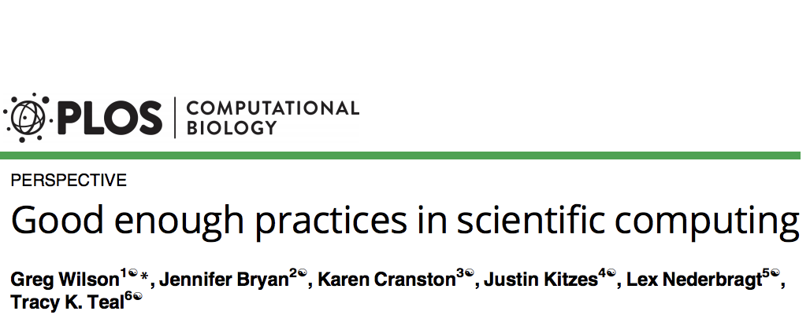
```

.footnote[
Wilson, Greg, et al. PLoS computational biology 13.6 (2017): e1005510.
]

---

## Why R & RStudio

--

* .x15[Scriptability]

  - R is a full featured programming language with a healthy ecosystem that is relevant to Statistics and Data Science.

--

* .x15[Reproducibility]

  - Literate programming tools are built into the language (Sweave) and have been expanded and improved upon (knitr & rmarkdown)

--

* .x15[Collaboration]

  - Project management and integration with git
--

* .x15[Promotion]

  - git / GitHub, CRAN, blogdown, bookdown, ... 

---
class: middle
count: false

# Teaching Computing

---

## DSS Curriculum & Computing

```{r echo=FALSE, out.width="100%", fig.align="center"}
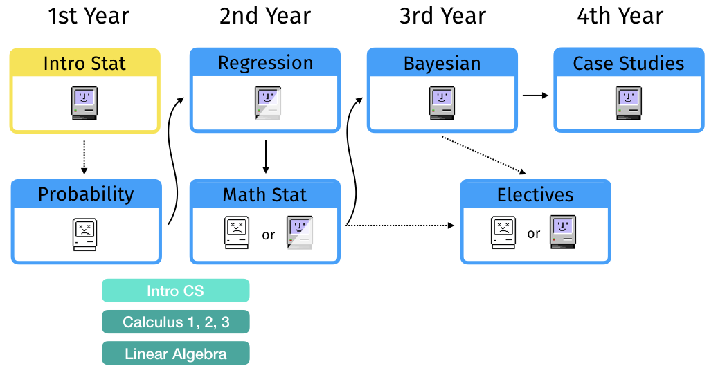
```


---
class: split-half

## Focus - Statistical Computing


.column[ .border[
#### Statistical Computing (Sta 323)
<hr/>

* 2nd / 3rd year undergrads

* Elective

* ~40 students

* Offered each Spring
]]

.column[ .border[
#### Statistical Programming (Sta 523)
<hr/>

* 1st year master's

* Required

* ~40 students

* Offered each Fall
]]

--


<div style="clear: both;"></div>

<br/><br/>

.bottom.center.x12[ <i>
*Programming course with statistics*

*vs.*

*Statistics course with programming*
]

---

## Workflow

.center[
```{r echo=FALSE,out.width="90%"}
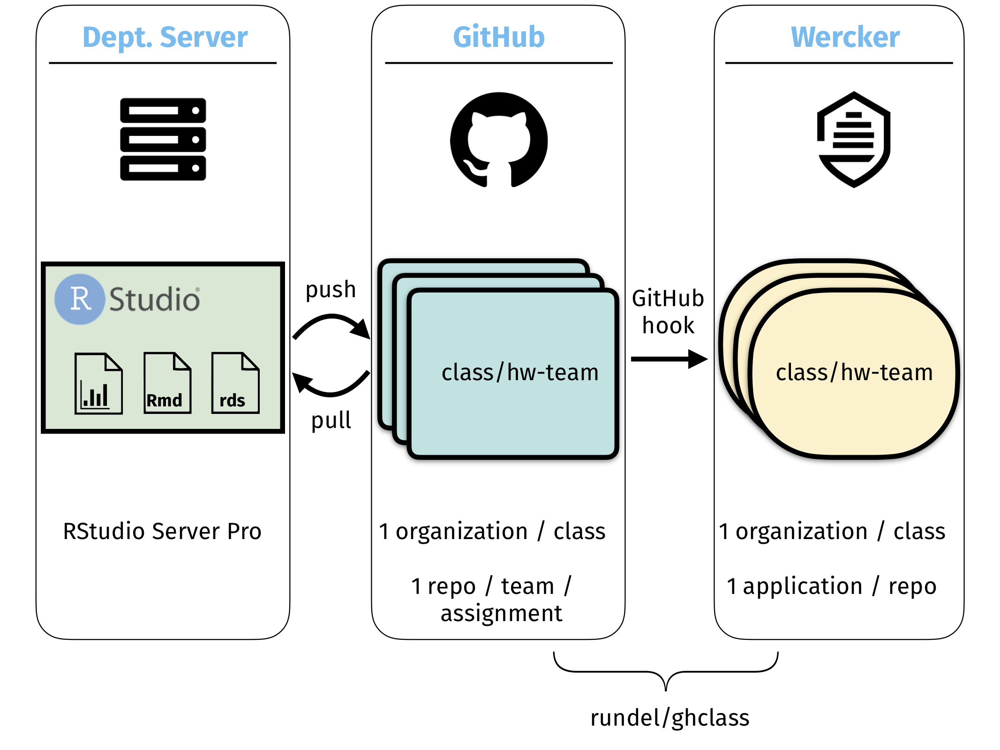
```
]

---

## Why RStudio Server

<br/>

.x15[
* Accessible from anywhere

* Zero configuration by students

* Software, configuration, data, etc. follows the student

* Centrally maintained and updated
]  
  

---

## Why GitHub

.x15[
All assignment (and project) related work is maintained on github 

* Forces students to use version control (git)

* Simplifies course administration
  - Code / documentation / scaffolding in one place
  - Easy to grab files (pull)
  - Easy to distribute files (push)
  - Built-in team permissions

* Searchability

* Accountability
]

---

## Teaching Reproducibility


.x15[
Enforcement of strict guidelines for all assignments,

1. All assignments must be completed as Rmarkdown documents

2. All assignments are distributed and must be turned in via GitHub

3. Intermediate and output files must not be commited

4. Instructor(s) must be able to successfully rerun all code (and will to produce final write-ups)
]

---

## Example Repository

```{r echo=FALSE}
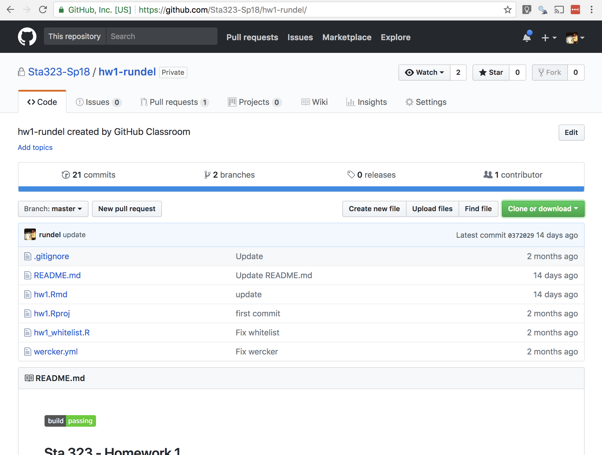
```

---

## Example Rmd template

```{r echo=FALSE}
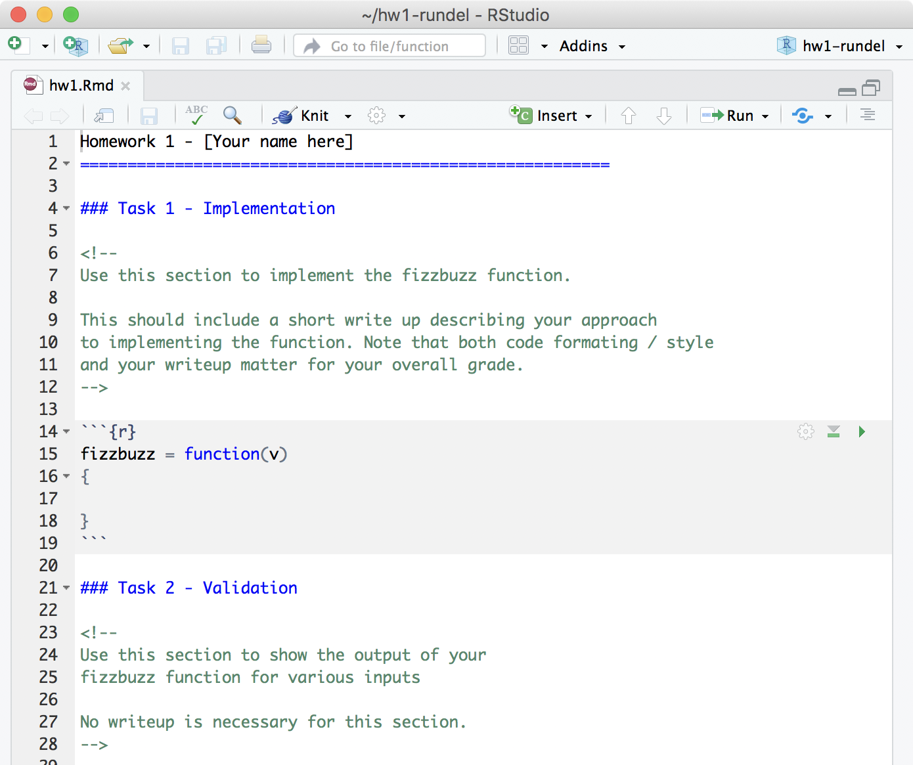
```

---

## Feedback loop

```{r echo=FALSE, out.width="50%", fig.align="center"}
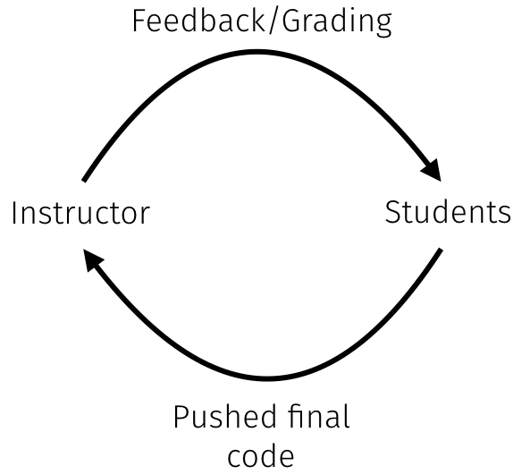
```

---

## Feedback loop (improved)

```{r echo=FALSE, out.width="100%", fig.align="center"}
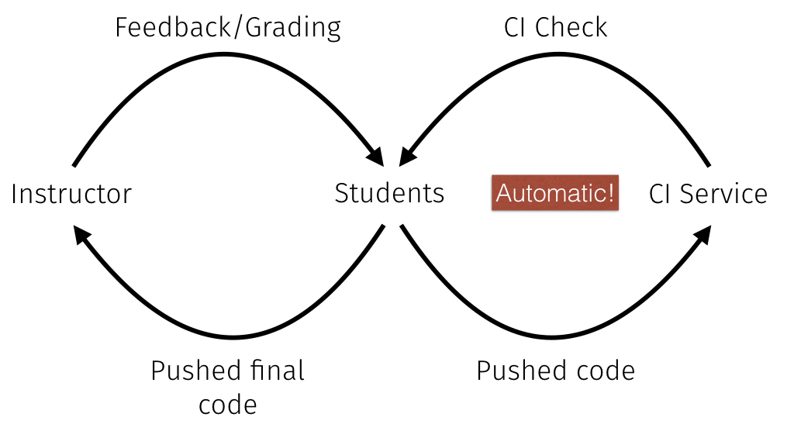
```


---

## Automatic testing

.x15[
We use wercker to test all student submissions (both intermediate and final),

.float-middle-main[ .float-middle[ 

* for reproducibility

* for file organization

* for style (styler, lintr)

* ...

* for correctness

] ] ]

---

## wercker.yml

```yaml
*box: rocker/tidyverse
build:
  steps:
    - script:
*       name: Check for allowed files
        code: |
          Rscript -e "source(paste0('https://raw.githubusercontent.com/',
                                    'Sta323-Sp18/hw1/master/hw1_whitelist.R')"
    - script:
*       name: Render R markdown
        code: |
          Rscript -e "library(rmarkdown);render('hw1.Rmd')"
```

---

.pull-left[
```{r echo=FALSE}
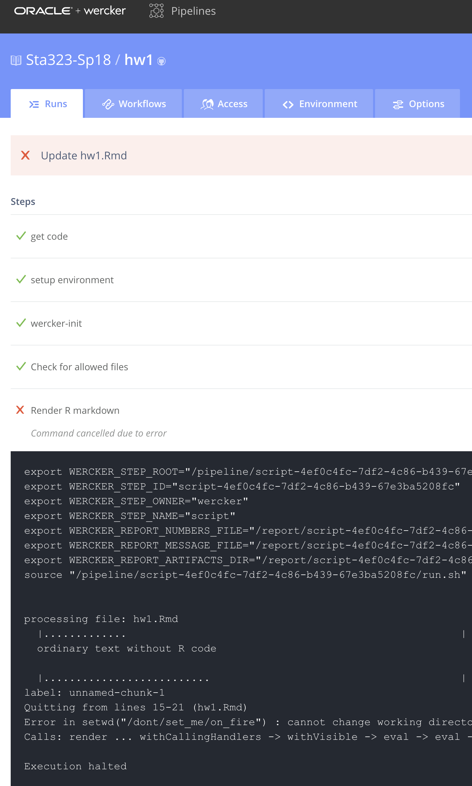
```
]

.pull-right[
```{r echo=FALSE}
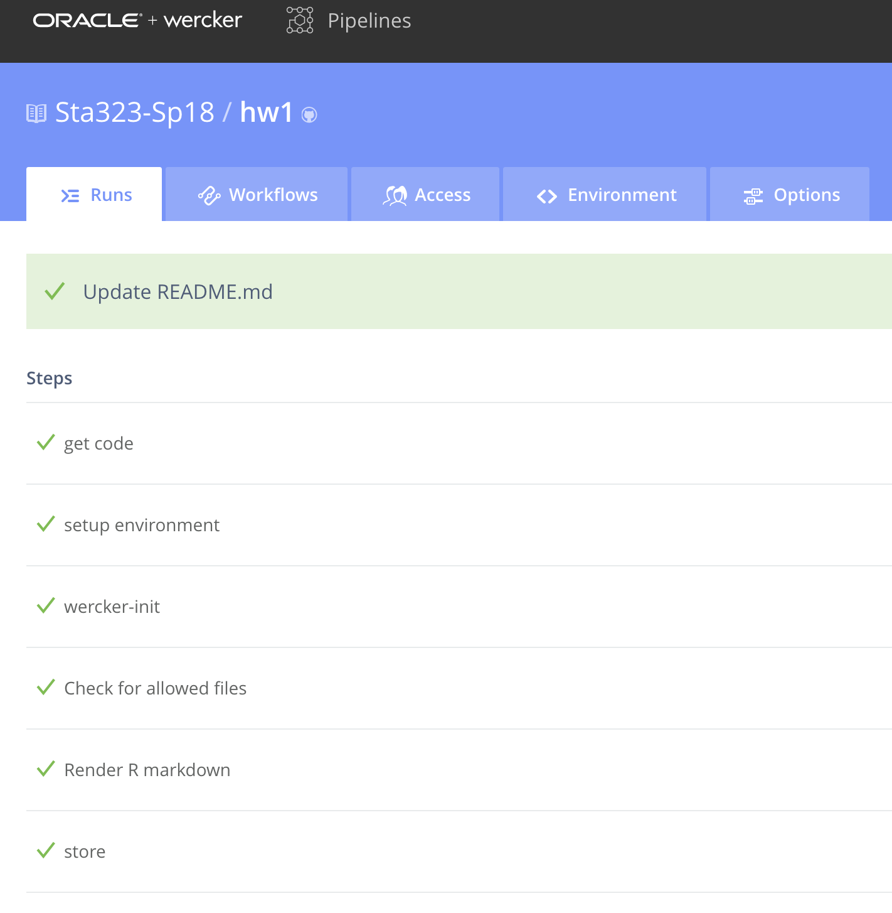
```
]

---

## Extending Automation

```{r echo=FALSE}
knitr::include_graphics("figs/wercker_score.gif")
```


---

## Downstream Effects

.x15[
* Uniformity of environment

* Leverage skills in later StatSci courses

  - Assume familiarity with R + RStudio
  
  - Assume familiarity with reproducibility and version control 
  
* Focus on computing that is relevant to a particular course
]


---
class: middle
count: false

# Physical Infrastructure

---

## Considerations

.x15[Per semester enrollment accross StatSci:]

.center.x12[~400 service,  ~150 majors / minors,  ~100 masters', ~30 Ph.D.]

<br/>

.x15[
* R + RStudio (Server)

* Ease of on-boarding

* Ease of maintenance & upgrades

* Grows with students

* Cost
]
---

## Previous approaches

<br/>  

.x15[
* Computer Labs

<br/>

* Personal Laptops
]

---

## Approach #1 - RStudio Server + Docker

```{r echo=FALSE, out.width="90%", fig.align="center"}
knitr::include_graphics("figs/dss/docker.png")
```

.footnote[
From [Çetinkaya-Rundel & Rundel (2017) Infrastructure and tools for teaching computing throughout the statistical curriculum, The American Statistician, DOI: 10.1080/00031305.2017.1397549](https://www.tandfonline.com/doi/abs/10.1080/00031305.2017.1397549)
]

---

## What works?

.x15[ .checklist[
* R + RStudio (Server) - <i class="fas fa-check-circle" style="color:#73B666;"></i>

* Ease of on-boarding - <i class="fas fa-check-circle" style="color:#73B666;"></i>

* Ease of maintenance & upgrades - <i class="fas fa-minus-circle" style="color:#E6B05F;"></i>
 
* Grows with students - <i class="fas fa-times-circle" style="color:#CA5B54;"></i>

* Cost - <i class="fas fa-check-circle" style="color:#73B666;"></i>
] ]

--

<br/>
.x15[Met the needs of our service teaching courses but did not scale to the needs of upper level undergraduate or graduate courses.]

---

## Beyond RStudio

```{r echo=FALSE, out.width="90%", fig.align="center"}
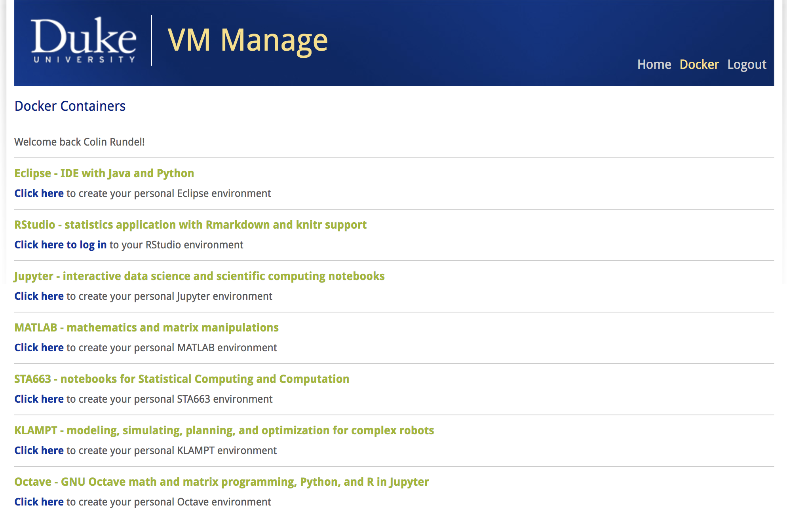
```

---

## Approach #2 - Centralized Server(s)

```{r echo=FALSE, out.width="100%", fig.align="center"}
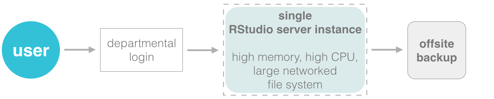
```

<br/>

.x12[
* Access provided only students enrolled in DSS courses

* Three separate servers to cater to undergraduates, masters', and Ph.D. students separately 
]

.footnote[
From [Çetinkaya-Rundel & Rundel (2017) Infrastructure and tools for teaching computing throughout the statistical curriculum, The American Statistician, DOI: 10.1080/00031305.2017.1397549](https://www.tandfonline.com/doi/abs/10.1080/00031305.2017.1397549)
]

---

## What works?

.x15[.checklist[
* <i class="fas fa-check-circle" style="color:#73B666;"></i> R + RStudio (Server)

* <i class="fas fa-check-circle" style="color:#73B666;"></i> Ease of on-boarding

* <i class="fas fa-check-circle" style="color:#73B666;"></i> / <i class="fas fa-minus-circle" style="color:#E6B05F;"></i> Ease of maintenance & upgrades
 
* <i class="fas fa-check-circle" style="color:#73B666;"></i> Grows with students

* <i class="fas fa-times-circle" style="color:#CA5B54;"></i> Cost
] ]

---

## Research vs Teaching Infrastructure


.x15[Primary role of the departmental servers is to support teaching]

--

* .x15[System usage tends to be very uneven,]

--

* .x15[Ph.D. students see unused cores,]

--

* .x15[somewhat regular conflicts between "research" jobs and class usage]

--

* .x15[exacerbated by previous infrastructure investment strategies

  - "shared" desktops at Ph.D. student desks
  
  - higher end machines exclusively purchased and owned by individual Faculty
]

---

## Servers vs Cluster

.x15[
* There is significant value in shared infrastructure and significant costs in building and maintaining your own solutions

* Reluctance to invest in Cluster due to perceived lack of flexibility, poor ROI, and opportunity costs

* Failure to recognize the different needs inherent in "interactive" vs "non-interactive" tasks
]

---

## Final thoughts

.x15[
* Accessibility matters

* Teach tools that are useful across multiple classes / outside the classroom

* Learn from the best practices of other disciplines

* Invest in infrastructure with an eye towards the limiting case (within reason)

* Leverage campus wide resources
]

---

## Acknowledgements

.x15[
* Duke OIT
  - Mark McCahill

* Duke Research Computing
  - Mark DeLong

* StatSci IT
  - Larry Hall
  - Frisco Rose
]

---

# Questions / Comments

.middle[ .center[

<table class="contact" style="width: 50%; text-align: left; font-size: 120%;">
<tbody>
<tr>
  <td style="vertical-align: middle;"> <i class="fas fa-envelope fa-fw fa-2x"></i> </td>
  <td> 
    <a href="mailto:rundel@gmail.com">rundel@gmail.com</a>
  </td>
</tr>
<tr>
  <td style="vertical-align: middle;"> <i class="fab fa-github-square fa-fw fa-2x"></i> </td>
  <td> 
    <a href="https://github.com/rundel">github.com/rundel</a>
  </td>
</tr>
<tr>
  <td style="vertical-align: middle;"> <i class="fab fa-twitter-square fa-fw fa-2x"></i> </td>
  <td> 
    <a href="https://twitter.com/rundel">@rundel</a>
  </td>
</tr>
<tr>
  <td style="vertical-align: middle;"> <i class="fas fa-home fa-fw fa-2x"></i> </td>
  <td> 
    <a href='http://stat.duke.edu/~cr173'>stat.duke.edu/~cr173</a>
  </td>
</tr>
</tbody>
</table>

] ]

