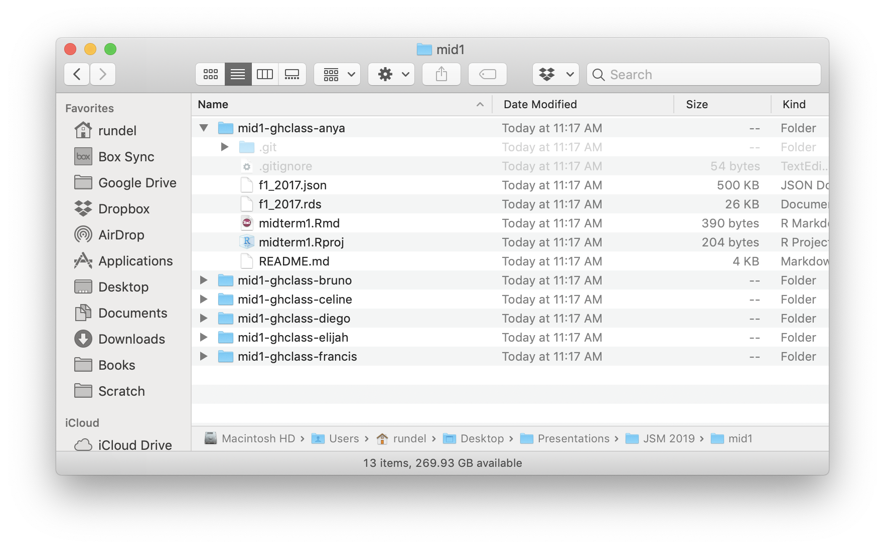

exclude: true

```{r setup, message=FALSE, warning=FALSE, include=FALSE}
fansi::set_knit_hooks(knitr::knit_hooks)
options(crayon.enabled = TRUE)

knitr::opts_chunk$set(cache = TRUE, fig.align="center")

library(ghclass)
```

```{r cleanup, include = FALSE}
repo_delete(org_repos("ghclass-demo"), prompt = FALSE)
team_delete("ghclass-demo", org_teams("ghclass-demo"), prompt = FALSE)
org_remove("ghclass-demo", org_members("ghclass-demo", include_admins = FALSE), prompt = FALSE)
unlink("mid1/", TRUE, TRUE)
```

```{r student_pats, include = FALSE}
enc = readRDS("~/Desktop/Projects/ghclass/credentials/example_users.enc.rds")
key = sodium::sha256(charToRaw(Sys.getenv("GHCLASS_PAT")))
pats = unserialize( sodium::data_decrypt(enc, key) )
```

---
class: title_bg

.title[
ghclass
]

.subtitle[
an R package for managing classes with GitHub
]


.conference[
.name[
JSM 2019 &middot; Denver
]
.bitly[
[bit.ly/JSM2019_ghclass](http://bit.ly/JSM2019_ghclass)
]
]

.author[
.name[
Colin Rundel
]
.school[
Univ of Edinburgh &middot;
Duke Univ
]
]

---

## Reproducible Assignments


**Goals**:

* Teach (enforce) version control and reproducible workflows

* Encourage (enforce) collaboration

* Embrace modern tools and methods

--

<br/>

**Organization**:

* Core toolkit: R + RStudio + RMarkdown

* Spend 1 lecture on git / GitHub

* GitHub setup:
  
  * 1 organization / course

  * 1 repo / (team | student) / assignment
  
* Randomly assigned teams of 3-4 students / assignment

---

## Setup

1. .sep[ Signup for a GitHub Account

[github.com]() ]

2. .sep[ Get a GitHub personal access token (PAT)

[github.com/settings/tokens](https://github.com/settings/tokens) ]

3. .sep[ Setup git and GitHub access in R

[`usethis` setup vignette](https://usethis.r-lib.org/articles/articles/usethis-setup.html) & <br/> [happy git with R](https://happygitwithr.com/) ]

3. .sep[ Signup for GitHub Education

[education.github.com/benefits](https://education.github.com/benefits) ]

4. .sep[ Create a GitHub Organization for your class 

[github.com/organizations/new](https://github.com/organizations/new) ]

<br/>

.center[
Only **Step 5** needs to be repeated for a new class!
]

---

## Introduction to `ghclass`

```{r fake_install, eval = FALSE}
devtools::install_github("rundel/ghclass")
library(ghclass)
```

--

<br/>

Some design principals behind this package:

1. Functions are prefixed with `org`, `repo`, `team`, `github` or `local_repo` to indicate what they operate on.

2. Functions are vectorized over their parameters  (batch related operations).

3. Be verbose about what is happening, report failures but don't halt execution.

4. Most actions are non-destructive (backed by git), the handful of dangerous operations will warn you.

5. Follow the unix design philosophy, work towards simple & composable functions

---

## Org & Roster

We will be using [ghclass-demo](https://github.com/ghclass-demo) as our class organization, hopefully your Org has a slightly more informative name .

--

.center[
(I find `course#`-`semester` works well, e.g. `Sta323-Sp19`).
]

--

<br/><br/>

```{r roster, message = FALSE}
(roster = readr::read_csv("files/roster.csv"))
```

---
background-image: url("imgs/01_github_empty.png")
background-position: center
background-size: contain

---

## Checking your git / GitHub config


```{r good_token}
github_test_token()
```

--

```{r sitrep}
usethis::git_sitrep()
```

---

## Inviting Students

```{r invite}
org_invite(org = "ghclass-demo", user = roster$github)
```

--

```{r status1-1}
org_members("ghclass-demo", include_admins = FALSE)
```

```{r status1-2}
org_pending_members("ghclass-demo")
```

---
background-image: url("imgs/02_github_members.png")
background-position: center
background-size: contain

---
background-image: url("imgs/03_github_pending.png")
background-position: center
background-size: contain

---

## A few days later ...

```{r accept1, include = FALSE}
ghclass:::org_accept_invite("ghclass-demo", names(pats)[1:4], pats[1:4])
```

```{r status2-1}
org_members("ghclass-demo", include_admins = FALSE)
```

```{r status2-2}
org_pending_members("ghclass-demo")
```

--

<br/>

## several emails and a week later  ...

```{r accept2, include = FALSE}
ghclass:::org_accept_invite("ghclass-demo", names(pats)[5:6], pats[5:6])
```

```{r status3-1}
org_members("ghclass-demo", include_admins = FALSE)
```

```{r status3-2}
org_pending_members("ghclass-demo")
```

---
background-image: url("imgs/04_github_accepted.png")
background-position: center
background-size: contain

---

## Team Assignment

```{r assignment}
org_create_assignment(org = "ghclass-demo", repo = roster$hw01, user = roster$github, 
                      team = roster$hw01, source_repo = "Sta323-Sp19/hw1")
```

---
background-image: url("imgs/05_github_hw01_repos.png")
background-position: center
background-size: contain

---

```{r clean-a-bit, include=FALSE}
team_delete("ghclass-demo", org_teams("ghclass-demo"), prompt = FALSE)
repo_delete(org_repos("ghclass-demo"), prompt = FALSE)
```

.smaller[
```{r step-by-step}
team_create("ghclass-demo", team = roster$hw01)
team_invite("ghclass-demo", user = roster$github, team = roster$hw01)
repo_create("ghclass-demo", name = roster$hw01)
repo_add_team(repo = org_repos("ghclass-demo", filter = "hw01-"), 
              team = org_teams("ghclass-demo", filter = "hw01-"))
repo_mirror(source_repo = "Sta323-Sp19/hw1", 
            target_repo = org_repos("ghclass-demo", filter = "hw01-"))
```
]

---

## Individual Assignment

```{r exam}
org_create_assignment(org = "ghclass-demo", repo = paste0("mid1-", roster$github),
                      user = roster$github, source_repo = "Sta323-Sp19/midterm1")
```

---
background-image: url("imgs/06_github_mid1_repos.png")
background-position: center
background-size: contain

---

## What about GitHub Classroom?

```{r fig.align="center", out.width="100%", echo=FALSE}

```

---

## Making Changes

```{r add_file}
repo_add_file(repo = org_repos("ghclass-demo", "hw01-"),
              file = "files/fizzbuzz.png")
```

--

```{r add_file2}
repo_add_file(repo = org_repos("ghclass-demo", "hw01-"),
              file = "files/fizzbuzz.png", overwrite = TRUE)
```

---
background-image: url("imgs/10_github_readme1.png")
background-position: center
background-size: contain

---

## Modify a file

```{r modify_file}
repo_modify_file(repo = org_repos("ghclass-demo", "hw01-"), file = "README.md",
                 pattern = "on Thursday 1/24/2019.", content = "on Wednesday 10/07/2019.")
```

--

```{r echo=FALSE, out.width="75%"}

```

---

## Collect student work

```{r clone}
local_repo_clone(repo = org_repos("ghclass-demo", "mid1-"), local_path = "mid1")
```

--

```{r echo=FALSE, out.width="65%", fig.align="center"}

```

---

## Organize student work

```{r rename}
local_repo_rename(repo_dir = "mid1", pattern = roster$github, 
                  replacement = paste0(roster$netid, "-(\\1)"))
```

--

```{r echo=FALSE, out.width="65%", fig.align="center"}

```

---

## Feedback?

```{r student_code, include=FALSE}
repo_add_file("ghclass-demo/hw01-team01", file = "files/hw1.Rmd", overwrite = TRUE)
```

```{r style}
repo_style("ghclass-demo/hw01-team01", files = "*.Rmd", draft = TRUE)
```

--

```{r pull-req, echo=FALSE, out.width="60%"}

```

---
background-image: url("imgs/16_github_diff.png")
background-position: center
background-size: contain

---

## Future Work

* We will be submitting to CRAN in the next month

* Active summer project adding functionality for peer review by Mine Cetinkaya-Rundel and Therese Anders

* Support for GitHub actions for automated feedback ([rundel/wercker](https://github.com/rundel/wercker) replacement)

* Support more workflows, if you use a GitHub based workflow for teaching that was not reflected here please get in touch.

---

# Thank you!

.middle[ .center[

<div style="width: 98%">
<table class="contact" style="text-align: left; font-size: 120%; margin-left:auto; margin-right:auto; width:50%;">
<tbody>
<tr>
  <td style="vertical-align: middle;"> <i class="far fa-file-powerpoint fa-fw fa-2x"></i> </td>
  <td> 
      <a href="http://bit.ly/User2019_ghclass">bit.ly/JSM2019_ghclass</a>
  </td>
</tr>
<tr><td><br/></td></tr>
<tr>
  <td style="vertical-align: middle;"> <i class="fas fa-box fa-fw fa-2x"></i> </td>
  <td> 
    <a href="https://github.com/rundel/ghclass">rundel/ghclass</a> <br/>
  </td>
</tr>
<tr><td><br/></td></tr>
<tr>
  <td style="vertical-align: middle;"> <i class="fas fa-map fa-fw fa-2x"></i> </td>
  <td> 
    <a href="https://rundel.github.io/ghclass">rundel.github.io/ghclass</a>
  </td>
</tr>
<tr><td><br/></td></tr>
<tr>
  <td style="vertical-align: middle;"> <i class="fab fa-github-square fa-fw fa-2x"></i> </td>
  <td> 
    <a href="https://github.com/rundel">github.com/rundel</a>
  </td>
</tr>
<tr><td><br/></td></tr>
<tr>
  <td style="vertical-align: middle;"> <i class="fas fa-envelope fa-fw fa-2x"></i> </td>
  <td> 
    <a href="mailto:rundel@gmail.com">rundel@gmail.com</a>
  </td>
</tr>
<tr><td><br/></td></tr>
<tr>
  <td style="vertical-align: middle;"> <i class="fab fa-twitter-square fa-fw fa-2x"></i> </td>
  <td> 
    <a href="https://twitter.com/rundel">@rundel</a>
  </td>
</tr>
</tbody>
</table>
</div>
] ]
