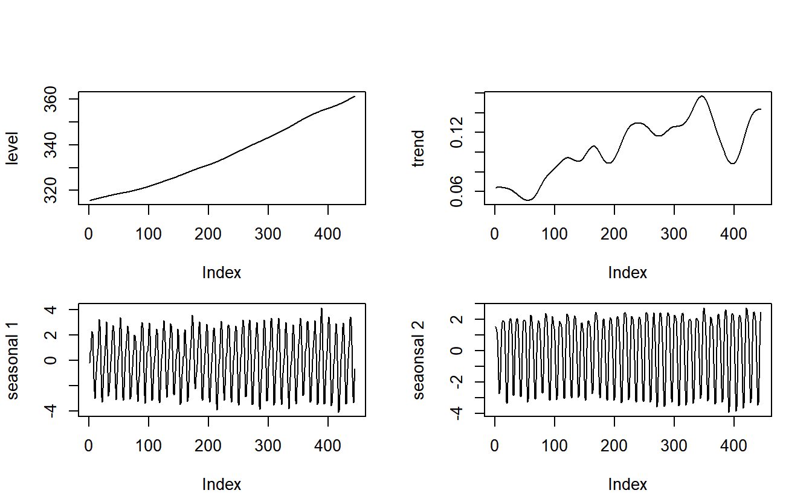
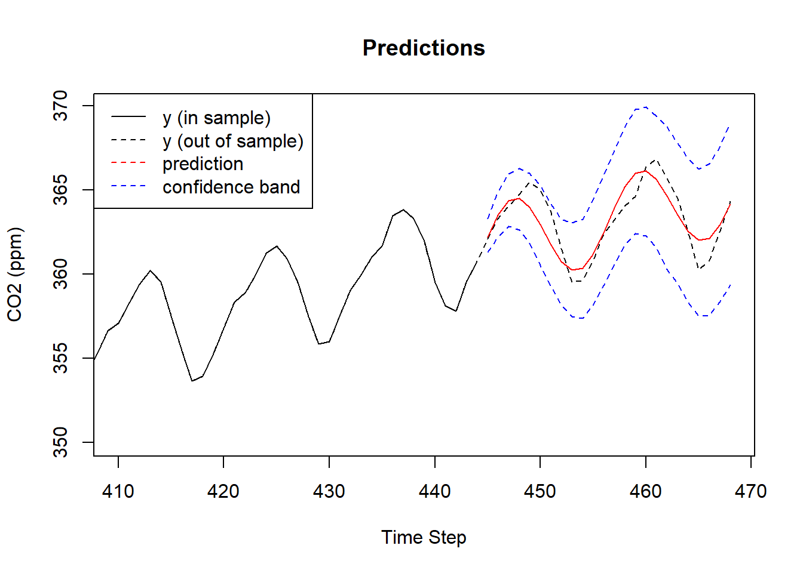
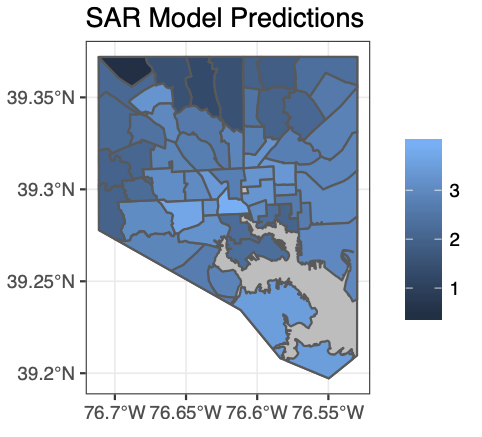
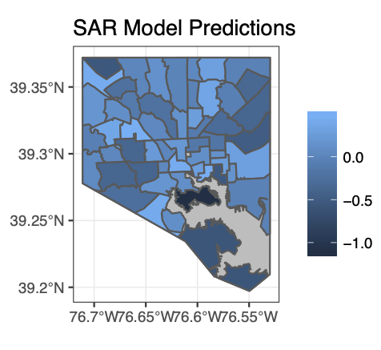

class: title_bg

.title[
Computation infrastructure for<br/>teaching Bayesian modeling
]

.conference[
  .name[ 
    JSM 2020 
  ]
  .bitly[ 
    [bit.ly/JSM2020_Sta444](https://bit.ly/JSM2020_Sta444)
  ] 
]

.author[
.name[
Colin Rundel
]
.school[
Univ of Edinburgh<br/>
Duke University
]
]

---

## Context

Sta 444 / 644 - Spatiotemporal Modeling

* 4th year undergraduate elective (2nd year MS elective)

* *Prereq* Sta 360 - Bayesian Inference and Modern Statistical Methods

* Weekly labs / problem sessions with TA

* 5 hws + 1 group project over the semester <br/>
(mathematical, computational, and applied problems)

---

## Learning Outcomes

* Modeling methods (lm, glm, ARIMA, GPs, CAR, etc.)

* Model assessment and validation

* Bayesian model implementation (probabilistic programming)

---

.columns[
.col[
DLM for predicting $\text{CO}_2$

```{r echo=FALSE, out.width="80%"}


```
]

.col[
Violent Crime in Baltimore City

```{r echo=FALSE, out.width="60%", fig.align="center"}


```
]
]


---

## Software

* Wide varierty of choices: BUGS, Jags, Stan, etc.

* Some considerations:

  * Generalizability vs. specificity
  
  * Syntactic complexity
  
  * Performance
  
  * Limitations


---

## Computational Complexity and Efficiency

This is often the first course where students engaged with models that cannot be fit "instantly".

* Basics of algorithmic complexity

* Model limitations vs software limitations

* Implementation vs run time

---

## Infrastructure

The platform provided for students matter:

* Configuration / Administration

* Performance

* Workflows

---

# Thank you!

.middle[ .center[

<div style="width: 98%">
<table class="contact" style="text-align: left; margin-left:auto; margin-right:auto; width:50%;">
<tbody>
<tr><td><br/></td><td>&nbsp;&nbsp;&nbsp;</td></tr>
<tr>
  <td style="vertical-align: middle;"> <i class="fas fa-envelope fa-fw fa-2x"></i> </td>
  <td></td>
  <td> 
    <a href="mailto:rundel@gmail.com">rundel@gmail.com</a>
  </td>
</tr>
<tr><td><br/></td></tr>
<tr>
  <td style="vertical-align: middle;"> <i class="fab fa-twitter-square fa-fw fa-2x"></i> </td>
  <td></td>
  <td> 
    <a href="https://twitter.com/rundel">@rundel</a>
  </td>
</tr>
<tr><td><br/></td></tr>
<tr>
  <td style="vertical-align: middle;"> <i class="far fa-file-powerpoint fa-fw fa-2x"></i> </td>
  <td></td>
  <td> 
      <a href="http://bit.ly/JSM2020_Sta444">bit.ly/JSM2020_Sta444</a>
  </td>
</tr>
<tr><td><br/></td></tr>
<tr>
  <td style="vertical-align: middle;"> <i class="fas fa-chalkboard-teacher fa-fw fa-2x"></i> </td>
  <td></td>
  <td> 
    <a href="http://www2.stat.duke.edu/~cr173/Sta444_Fa18/">stat.duke.edu/~cr173/Sta444_Fa18/</a>
  </td>
</tr>
</tbody>
</table>
</div>
] ]
