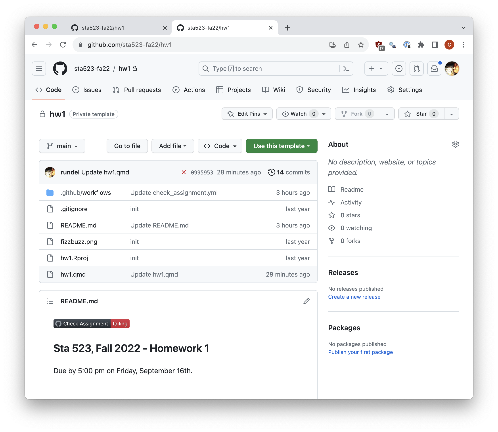
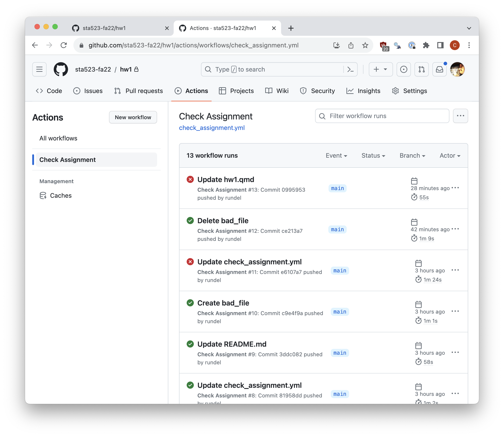
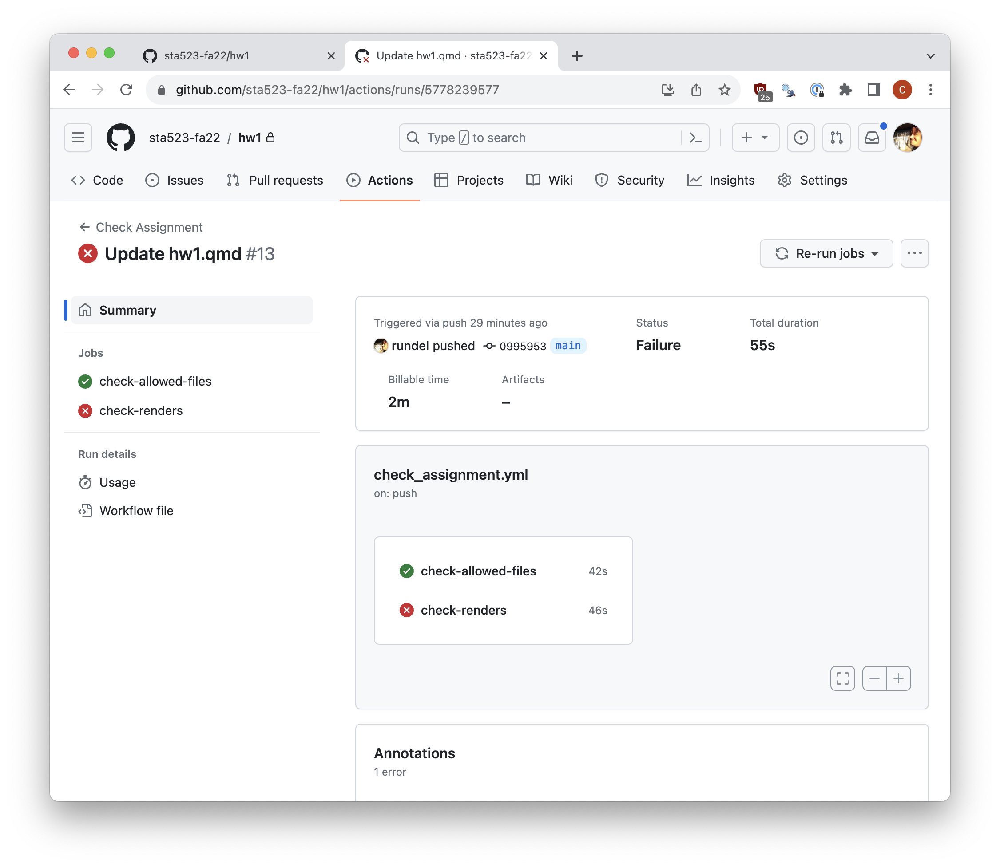
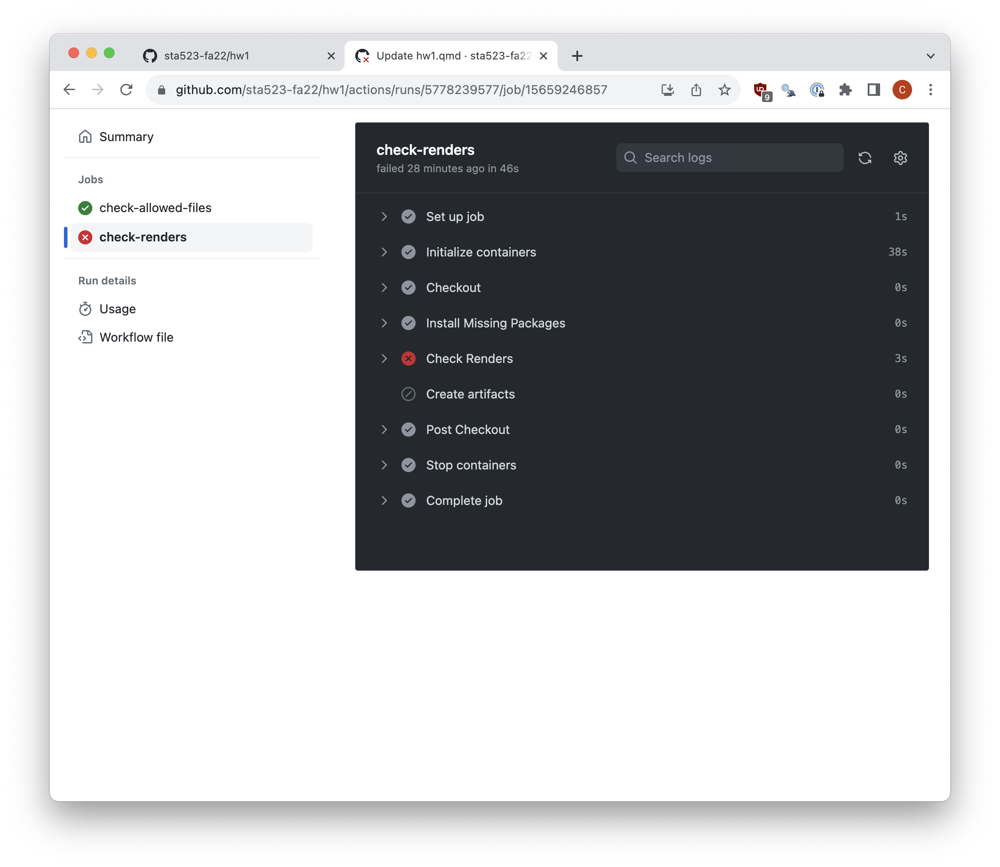
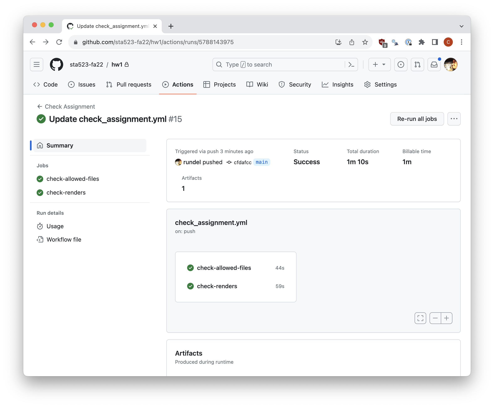
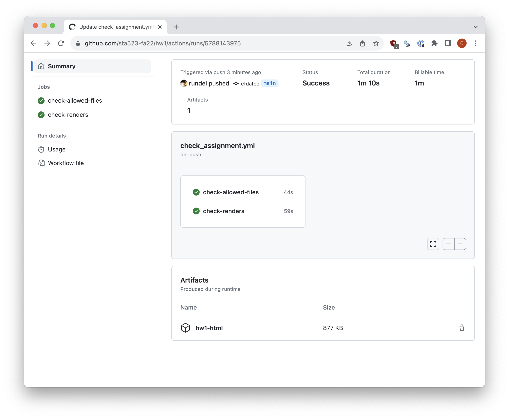
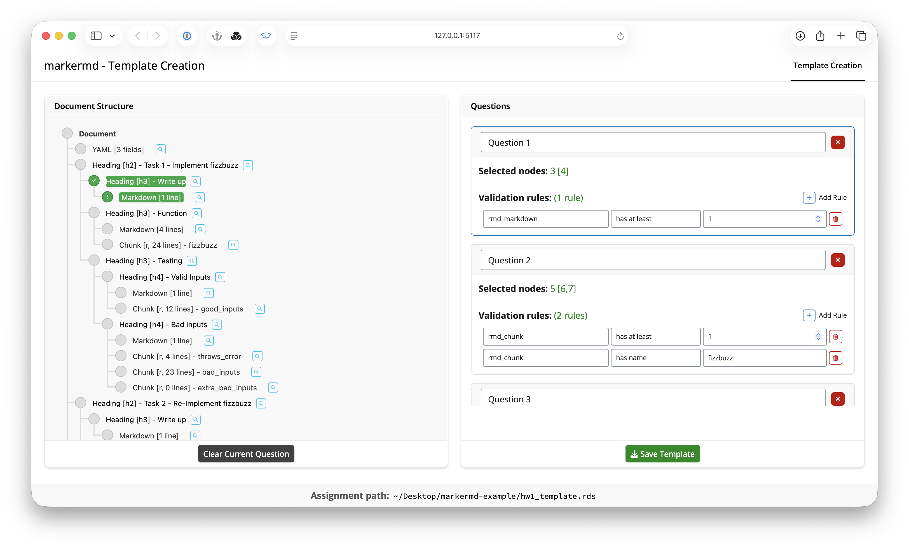
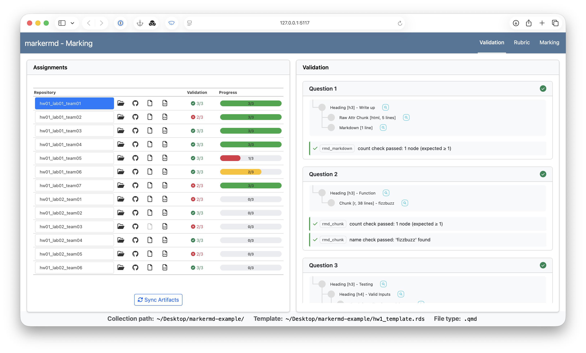
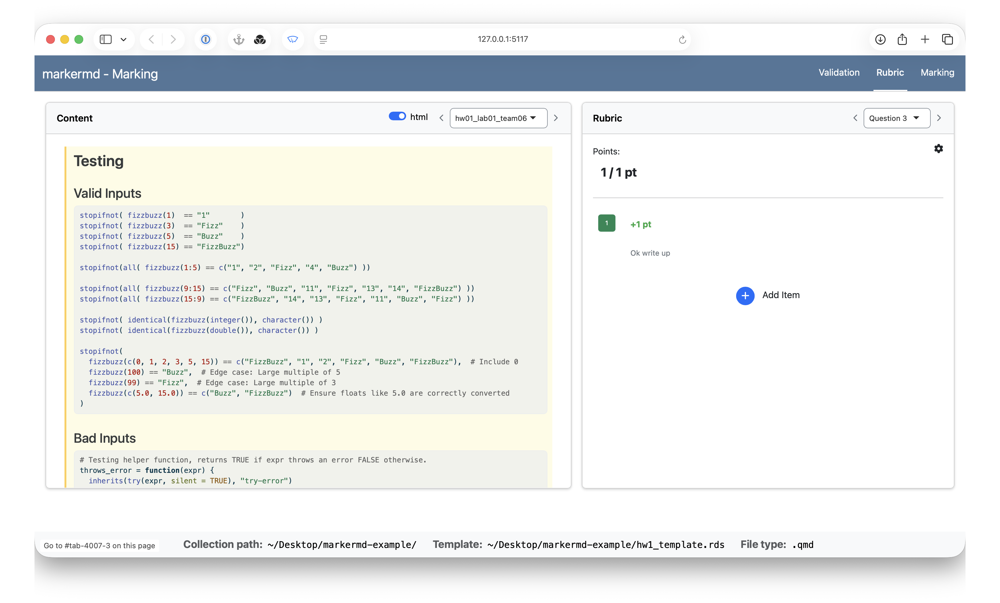

```{r setup}
#| include: false
options(width=80)
library(fontawesome)
library(ghclass)

# Everything this deck creates on GitHub is torn down by the last chunk in this
# file. Running that teardown up front too makes an interrupted render recoverable,
# and it deletes by constructed name because org_repos() and org_teams() read a
# search index that lags behind the writes by a minute or more.
demo_teams = readr::read_csv("github_roster.csv", show_col_types = FALSE) |>
  team_roster(
    size = 3, by = "section",
    name = "jsm26_lab{section}_team{team_id}", pad = 2, seed = 20250901
  ) |>
  dplyr::pull(team) |>
  unique()

try(repo_delete(paste0("ghclass-paper/", demo_teams), prompt = FALSE), silent = TRUE)
try(team_delete("ghclass-paper", demo_teams, prompt = FALSE), silent = TRUE)
unlink("hw1", recursive = TRUE)
```

## Who am I

Assoc. Professor of the Practice, Dept. of Statistical Science, Duke University

::: {.course-list}
* [Sta 523](https://sta523-fa25.github.io/) - Programming for Statistical Science [R, 1st yr MS]{.since}

* [Sta 323](https://sta323-sp26.github.io/) - Statistical Computing [R, 2nd,3rd yr UG]{.since}

* [Sta 663](https://sta663-sp26.github.io/) - Statistical Computing and Computation [Python, 1st yr MS]{.since}
:::

All three courses run on GitHub - one (private) organization per course, students added as members, one repository per assignment per student or team.

::: {.aside}
~3,800 repositories (individual and team) over the last decade
:::


## Click or script?

Myself and others have written a lot about why you should be using Git & GitHub for your courses.

Having adopted GitHub, you still have to decide how to manage things.

* Point-and-click is fine for small courses and tasks

* GitHub Classroom reduces the number of clicks (but doesn't eliminate them) and constrains workflows

* Using the API is what makes things scale

  * one function call can iterate over an entire roster


::: {.aside}
GitHub classrooms has also gone away - sign-ups closed May 2026, decommissioned July 2026
:::

## `ghclass`

An R package that wraps the GitHub REST and GraphQL APIs in class focused operations.

:::: {.columns .medium}
::: {.column width='50%'}
* `github_` - auth and account
* `org_` - membership, teams, repos
* `repo_` - files, collaborators, settings
* `team_` - teams within an org
* `user_` - GitHub accounts
:::

::: {.column width='50%'}
* `issue_` - issues
* `pr_` / `branch_` - PRs and branches
* `action_` - runs, artifacts, badges
* `pages_` - GitHub Pages
* `local_repo_` - local git ops (clone, commit, ...)
:::
::::

. . .

Functions are vectorized over a roster (data frame), API wrapped in `purrr::safely()`, and report success or failure per operation.

::: {.aside}
v0.4.1 on CRAN - workflow that follows is documented in the repo and a soon-to-be-submitted paper (JSDSE)
:::


## Course as organization

One org per course per semester. Students added as *members* (to use teams). The default repository permission is set to `none`, so students only see their assigned repos.

:::: {.columns}
::: {.column width='55%'}
```{r}
org_repos("ghclass-paper")
```
:::

::: {.column width='45%' .fragment}
* Templates repos (`hw1`, `midterm1`)
* Key repos (`hw1-key`)
* Student repos (`hw1_lab01_*`, `midterm1_ghclass-*`)
* Workflow details (`instructor`)
:::
::::


## 1. Setting up the course

Configure the organization *before* anyone is invited:

```{r}
#| message: true
org_set_repo_permission("ghclass-paper", "none")
org_set_workflow_permissions("ghclass-paper", "read")
```

. . .

Check the org's status with:

```{r}
#| message: true
org_sitrep("ghclass-paper")
```

## Adding students

Collect student usernames via a web form / survey and validate before inviting:

```{r}
user_exists(c("rundel", "mine-cetinkaya-rundel", "ghclass-alice"))
```

Use ghclass to manage invites:

```{r}
#| eval: false
need = setdiff(
  responded$github,
  c(org_members("ghclass-paper"), org_pending("ghclass-paper"))
)

org_invite("ghclass-paper", need)
```

::: {.aside}
The roster file is typically a join between LMS export and survey results
:::


## 2.1 Assignments as repositories

::: {.medium}
* `hw1` - the source repo, holds the student scaffold and the CI config

* `hw1-key` - the answer key

* `hw1_lab01_team01`, ... - one repo per team/individual, mirrored from the source
:::


::: {.columns}

::: {.column}
```{r}
repo_tree("ghclass-paper/hw1")
```
:::

::: {.column}
```{r}
repo_tree("ghclass-paper/hw1-key")
```
:::

:::


## 2.2 Assigning teams

Per assignment we  build a roster that tracks student details and random team assignments,

```{r}
roster = readr::read_csv("github_roster.csv", show_col_types = FALSE) |>
  team_roster(
    size = 3, 
    by   = "section",
    name = "jsm26_lab{section}_team{team_id}",
    pad = 2,
    seed = 20250901
  )

roster |> dplyr::select(name, email, section, github, team)
```

::: {.aside}
Teams are just a column in the roster - these can also be manual created
:::

::: {.notes}
Size is the desired team size (we typically use 4)

Padding applies numeric pading to the team index e.g. 02 vs 2

This function is useful if you want to do random team assignments
:::

## 2.3 Distributing an assignment

Make sure the source repo is a *template*,

```{r}
#| message: true
repo_set_template("ghclass-paper/hw1")
```

then create student repos from it,

```{r}
#| message: true
org_create_assignment(
  org         = "ghclass-paper",
  repo        = roster$team,
  user        = rep("rundel", nrow(roster)),
  team        = roster$team,
  source_repo = "ghclass-paper/hw1",
  add_badges  = TRUE
)
```

::: {.aside}
Individual assignments are created with the same function, just without the `team` argument
:::


## 3.1 Live assignments

While an assignment is open, student work is queryable and assignments can be edited / corrected,


```{r}
repos = org_repos("sta523-fa25", "hw01_")
```

::: {.columns}

::: {.column}
```{r}
repo_n_commits(repos)
```
:::

::: {.column}
```{r}
#| eval: false
repo_add_file(
  repos, 
  file = "late_addition.csv", 
  repo_folder = "data"
)
```

```{r}
#| eval: false
repo_modify_file(
  repos, path = "README.md",
  pattern = "Due: .*", 
  content = "Due: 2026-09-22", 
  method = "replace"
)
```
:::

:::


## 3.2 Automated feedback

GitHub Actions provide a powerful tool for automating a varierty of things,

* Our feedback usually focuses process not correctness (reproducibility)

* We include workflows in student repos (`.github/workflows/check_assignment.yml`) as part of the source repo

* The checks are mostly R functions from [`checklist`](https://github.com/rundel/checklist) - required files present, document renders, etc.

* Uses a prebuilt docker image - [`r_gh_action`](https://github.com/DukeStatSci/r_gh_actions)

* `add_badges = TRUE` at distribution put a pass / fail badge at the top of each README


## `.github/workflows/check_assignment.yml` {.smaller}

```{.yaml code-line-numbers="|1|4-18|6-7|13-17|19-34|26-28|30-34"}
on: push
name: Check Assignment
jobs:
  check-allowed-files:
    runs-on: ubuntu-latest
    container:
      image: ghcr.io/dukestatsci/r_gh_actions:latest
    steps:
    - name: Checkout
      uses: actions/checkout@v7
    - name: Check Files
      run: |
        checklist::quit_on_failure({
          checklist::check_allowed_files(
            c("hw1.qmd", "hw1.Rproj", "README.md", "data/*")
          )
        })
      shell: Rscript {0}
  check-renders:
    runs-on: ubuntu-latest
    container:
      image: ghcr.io/dukestatsci/r_gh_actions:latest
    steps:
    - name: Checkout
      uses: actions/checkout@v7
    - name: Check Renders
      run: |
        checklist::check_qmd_renders("hw1.qmd", install_missing = TRUE)
      shell: Rscript {0}
    - name: Create artifacts
      uses: actions/upload-artifact@v7
      with:
        name: hw1-html
        path: hw1.html
```

::: {.notes}
Steps should be self explanitory - this is a simplified version of the real thing

Point out the artifact bit is important
:::


## What students see

::: {.r-stack}
{fig-align="center" width="100%"}

{.fragment fig-align="center" width="100%"}

{.fragment fig-align="center" width="100%"}

{.fragment fig-align="center" width="100%"}

{.fragment fig-align="center" width="100%"}

{.fragment fig-align="center" width="100%"}
:::


```{r}
#| include: false
# org_repos() reads a search index that lags a little behind repo creation, so
# give the repos distributed a few slides ago time to show up before collecting.
for (i in 1:30) {
  if (length(org_repos("ghclass-paper", "jsm26_")) == length(demo_teams)) break
  Sys.sleep(2)
}
```

## 4.1 Collecting assignments

After the due date, clone every repo, downloads CI artifacts, and scaffolds comment markdown files.

:::: {.columns .smaller}
::: {.column width='50%'}
```{r}
#| message: true
org_grade_assignment(
  "hw1", "ghclass-paper", "jsm26_",
  key_repo = "ghclass-paper/hw1-key",
  comment_template = "## hw1 feedback\n\n"
)
```
:::

::: {.column width='50%' .fragment}
```{r}
fs::dir_tree("hw1")
```
:::
::::

::: {.aside}
`artifacts = c(html = "hw1-html")` also pulls down each repo's rendered CI output
:::


## 4.2 Scores & feedback 

Numeric scores go to the gradebook, 

```{r}
#| eval: false
scores = readr::read_csv("hw1/scores.csv")
upload = dplyr::left_join(roster, scores, by = "team")

stopifnot(!any(is.na(upload$score)))

readr::write_csv(upload, "hw1/hw1_upload.csv")
```

. . .

<br/>

Written feedback shared via GitHub issues,

```{r}
#| message: true
comments = fs::dir_ls("hw1/comments", glob = "*.md")
repos    = paste0("ghclass-paper/", fs::path_ext_remove(fs::path_file(comments)))

issue_create(repos, title = "hw1 feedback", body = purrr::map_chr(comments, readr::read_file))
```

::: {.notes}
Upload to gradebooks require specific formating - we keep scores.csv simple and then join with a template file the gives us the specific format.

Comment files are just markdown files we read and then turn into issues.
:::

## `markermd`

An interactive (Shiny) grading interface for Quarto and R Markdown assignments that works with `org_grade_assignment()`.

::: {.r-stack .center}
{.fragment width="70%"}

{.fragment width="70%"}

{.fragment width="70%"}
:::

::: {.aside}
Built using [`q2r`](https://rundel.github.io/q2r) to parse and build the document tree shown above
:::

::: {.notes}
1st ss - Template builder - parses the key to build out a document template. We associate various questions with sections of the document using headers (`###`). Templates can also have rules that allow us to validate the content (e.g. this section must have one chunk and some markdown)

2nd ss - mark() validation tab - shows the result of applying the template across student repos, shows the validation status for each question as well as grading progress.

3rd ss - mark() marking tab - gradescope like interface for applying rubric items by question and repo. Left side highlights either the raw code or rendered output (if available) as you move between questions.

Not show - rubric interface that lets you add rubric items by question
:::


## Using `markermd`

A grading project (folder) is initialized with `init_project()` which creates `.markermd/`.

Once initialized you can use:

* `template()` to build an assignment template - document subsections and validation rules

* `mark()` to validate submissions, build a rubric, and apply it across submissions

* `export_marks()` to collects results and populates `scores.csv` and `comments/`

::: {.aside}
We include some *very* experimental Claude code skills which can be used to help automate the tasks above
:::


## Some advice

::: {.medium}

* Set `org_set_repo_permission()` and `org_set_workflow_permissions()` *before* anyone is invited, use `org_sitrep()` to check.

* Every org gets 2,000 Actions minutes / month free, 3,000 if using Team upgrade

  * easily exhausted for a medium-sized course - use self-host runners

* Artifacts expire after 90 days and count against org storage (500 MB free, 2 GB on Team) - just keep the latest

* Beware of secondary rate limits, e.g. bulk invitations and bulk issue creation

  * default cap of 50 invites/day

  * free Team upgrade via [GitHub Education](https://education.github.com) increases this

* Grading framework is well positioned for use with Agentic AI tools, but be aware of your schools data policies / FERPA / etc.

  * ghclass has initial support for "best effort" anonymization via `local_repo_anonymize()`

:::

## Reach out

<br/><br/>

::: {.large}
<table class="details">
  <tr>
    <td style="text-align:center">&nbsp;`r fa("home")`</td>
    <td><a href="https://rundel.github.io">rundel.github.io</a></td>
  </tr>
  <tr>
    <td style="text-align:center">&nbsp;`r fa("github")`</td>
    <td><a href="https://github.com/rundel/">rundel</a></td>
  </tr>
  <tr>
    <td style="text-align:center">&nbsp;`r fa("envelope")`</td>
    <td>
    <a href="mailto:rundel@gmail.com">rundel@gmail.com</a><br/>
    <a href="mailto:colin.rundel@duke.edu">colin.rundel@duke.edu</a>
    </td>
  </tr>
  <tr>
    <td style="text-align:center">&nbsp;`r fa("box-archive")`</td>
    <td>
    [rundel/ghclass](https://rundel.github.io/ghclass) &nbsp;
    [rundel/checklist](https://github.com/rundel/checklist)

    [rundel/q2r](https://rundel.github.io/q2r) &nbsp;
    [rundel/markermd](https://rundel.github.io/markermd)
    </td>
  </tr>
  <tr>
    <td style="text-align:center">&nbsp;`r fa("flask", prefer_type="solid")`</td>
    <td>
    [github.com/ghclass-paper](https://github.com/ghclass-paper)
    </td>
  </tr>
</table>
:::


```{r teardown}
#| include: false
# Remove everything the live chunks created in the demo org, and the local
# grading folder, so the deck leaves no trace and re-renders cleanly. Deleting
# the repo also deletes its issues.
repo_delete(paste0("ghclass-paper/", demo_teams), prompt = FALSE)
team_delete("ghclass-paper", demo_teams, prompt = FALSE)
unlink("hw1", recursive = TRUE)
```
