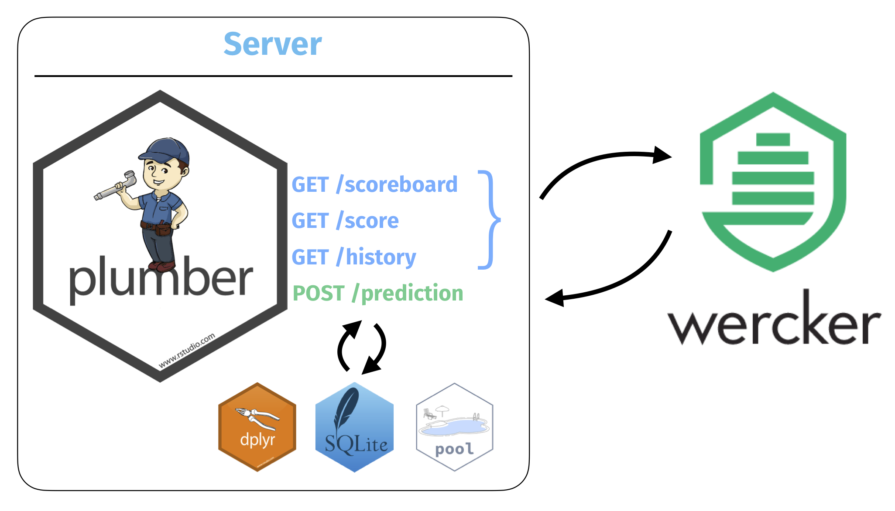

exclude: true

```{r, message=FALSE, warning=FALSE, include=FALSE}
options(
  htmltools.dir.version = FALSE, # for blogdown
  width = 80,
  tibble.width = 80
)

library(emo)
htmltools::tagList(rmarkdown::html_dependency_font_awesome())

library(magrittr)
library(emojifont)
```

---
class: split-half

# Context


.column[ .border[
#### Statistical Computing (Sta 323)
<hr/>

* 2nd / 3rd year undergrads

* Elective

* ~40 students

* Offered each Spring
]]

.column[ .border[
#### Statistical Programming (Sta 523)
<hr/>

* 1st year master's

* Required

* ~40 students

* Offered each Fall
]]

--


<div style="clear: both;"></div>

<br/><br/>

.bottom[ .center[ <i>
*Programming course with statistics*

*vs.*

*Statistics course with programming*
] ]


---

# Workflow

.center[
```{r echo=FALSE,out.width="90%"}
knitr::include_graphics("figs/workflow.png")
```
]

---

# Automatic testing ...

.float-middle-main[ .float-middle[ .big-text[

* for reproducibility

* for file organization

* for style (styler, lintr)

* ...

* for correctness

] ] ]

---

# wercker.yml

```yaml
*box: rocker/tidyverse
build:
  steps:
    - script:
*       name: Check for allowed files
        code: |
          Rscript -e "source(paste0('https://raw.githubusercontent.com/',
                                    'Sta323-Sp18/hw1/master/hw1_whitelist.R')"
    - script:
*       name: Render R markdown
        code: |
          Rscript -e "library(rmarkdown);render('hw1.Rmd')"
```

---
class: split-half

.column[
```{r echo=FALSE}
knitr::include_graphics("figs/wercker_bad.png")
```
]

.column[
```{r echo=FALSE}
knitr::include_graphics("figs/wercker_good.png")
```
]

---

# Kaggle&trade;?

```{r echo=FALSE}

```

---
class: split-half

# Goals

<br/>

.column[ .border[

#### Pedagogical
<hr/>

* Cleaning iteration

* Modeling iteration

* Diagnostics

* Effort cost-benefit

] ] 


.column[ .border[

#### Technical
<hr/>

* Automatic scoring

* Feedback / diagnostics

* Leaderboard

* History

] ]

---
class: split-thirds

## Task: tickets, taxes, and precincts

<br/>

.pull-left[
```{r echo=FALSE, out.width="50%"}

```
]

<div style="clear: both;"></div>

.column[ .border[
#### Parking Violations
<hr/>

* 9.1M tickets w/ 43 variables

* 1.7G csv

* *Human generated*

.center[
[source](https://data.cityofnewyork.us/City-Government/Parking-Violations-Issued-Fiscal-Year-2014-August-/jt7v-77mi)
]

] ]

.column[ .border[
#### Property Taxes
<hr/>

* MapPLUTO

* Shapefiles of property boundaries

* Includes addresses

.center[
[source](https://www1.nyc.gov/site/planning/data-maps/open-data/dwn-pluto-mappluto.page)
]

] ]

.column[ .border[
#### Police Precincts
<hr/>

* Shapefiles of boundaries

* 74 precincts

* 24 in Manhattan

.center[
[source](https://www1.nyc.gov/site/planning/data-maps/open-data/districts-download-metadata.page)
]

] ]


---

# Scoring

```{r echo=FALSE}

```

---

# Approach #1 - Wercker

.center[
```{r echo=FALSE, warning=FALSE, out.width="80%"}
knitr::include_graphics("figs/wercker_score.gif")
```
]

---

# wercker.yml

```yaml
box: rocker/tidyverse
build:
  steps:
    - script:
*     name: Update scores
      code: |
        Rscript -e "httr::stop_for_status(httr::POST('http://saxon.stat.duke.edu:7887/prediction', encode = 'json', body=list(team='$team', key='$key', file=base64enc::base64encode('precincts.geojson'))))"
    - script:
*     name: Show score
      code: |
        wget --quiet -O - http://saxon.stat.duke.edu:7887/score?t=$team
    - script:
*     name: Show leaderboard
      code: |
        wget --quiet -O - http://saxon.stat.duke.edu:7887/scoreboard
    - script:
*     name: Show history
      code: |
        wget --quiet -O - http://saxon.stat.duke.edu:7887/history?t=$team
    - script:
*     name: Check for allowed files
      code: |
        Rscript -e "source('https://raw.githubusercontent.com/Sta523-Fa17/hw6/master/hw6_whitelist.R')"
```

---

# Details

.center[
```{r echo=FALSE, warning=FALSE, out.width="100%"}

```
]

---

# Approach #2 - Shiny

.center[
```{r echo=FALSE, warning=FALSE, out.width="70%"}

```
]

---

# Overall

<br/>

.middle[
|                       | Wercker                            | Shiny                              |
|-----------------------|:----------------------------------:|:----------------------------------:|
|Automatic scoring      | <i class="far fa-smile fa-2x"></i> | <i class="far fa-frown fa-2x"></i> |
|Feedback / Diagnostics | <i class="far fa-frown fa-2x"></i> | <i class="far fa-smile fa-2x"></i> |
|Leaderboard            | <i class="far fa-smile fa-2x"></i> | <i class="far fa-frown fa-2x"></i> |    
|History                | <i class="far fa-smile fa-2x"></i> | <i class="far fa-frown fa-2x"></i> |
|Simplicity             | <i class="far fa-meh   fa-2x"></i> | <i class="far fa-smile fa-2x"></i> |
]

---
count: false

# Overall

<br/>

.middle[
|                       | Wercker                            | Shiny                              | Shiny + DB      |
|-----------------------|:----------------------------------:|:----------------------------------:|:---------------:|
|Automatic scoring      | <i class="far fa-smile fa-2x"></i> | <i class="far fa-frown fa-2x"></i> | <i class="far fa-frown fa-2x"></i>
|Feedback / Diagnostics | <i class="far fa-frown fa-2x"></i> | <i class="far fa-smile fa-2x"></i> | <i class="far fa-smile fa-2x"></i>
|Leaderboard            | <i class="far fa-smile fa-2x"></i> | <i class="far fa-frown fa-2x"></i> | <i class="far fa-smile fa-2x"></i>
|History                | <i class="far fa-smile fa-2x"></i> | <i class="far fa-frown fa-2x"></i> | <i class="far fa-smile fa-2x"></i>
|Simplicity             | <i class="far fa-meh   fa-2x"></i> | <i class="far fa-smile fa-2x"></i> | <i class="far fa-meh   fa-2x"></i>
]

---

# Thank you!

.middle[ .center[

<table class="contact" style="width: 50%; text-align: left; font-size: 120%;">
<tbody>
<tr>
  <td style="vertical-align: middle;"> <i class="fas fa-envelope fa-fw fa-3x"></i> </td>
  <td> 
    <a href="mailto:rundel@gmail.com">rundel@gmail.com</a>
  </td>
</tr>
<tr>
  <td style="vertical-align: middle;"> <i class="fab fa-github-square fa-fw fa-3x"></i> </td>
  <td> 
    <a href="https://github.com/rundel">github.com/rundel</a>
  </td>
</tr>
<tr>
  <td style="vertical-align: middle;"> <i class="fab fa-twitter-square fa-fw fa-3x"></i> </td>
  <td> 
    <a href="https://twitter.com/rundel">@rundel</a>
  </td>
</tr>
<tr>
  <td style="vertical-align: middle;"> <i class="far fa-file-powerpoint fa-fw fa-3x"></i> </td>
  <td> 
      <a href="http://bit.ly/rundel_rstudioconf2018">bit.ly/rundel_rstudioconf2018</a>
  </td>
</tr>
<tr>
  <td style="vertical-align: middle;"> <i class="fas fa-home fa-fw fa-3x"></i> </td>
  <td> 
    <a href='http://stat.duke.edu/~cr173'>stat.duke.edu/~cr173</a>
  </td>
</tr>
</tbody>
</table>

] ]

