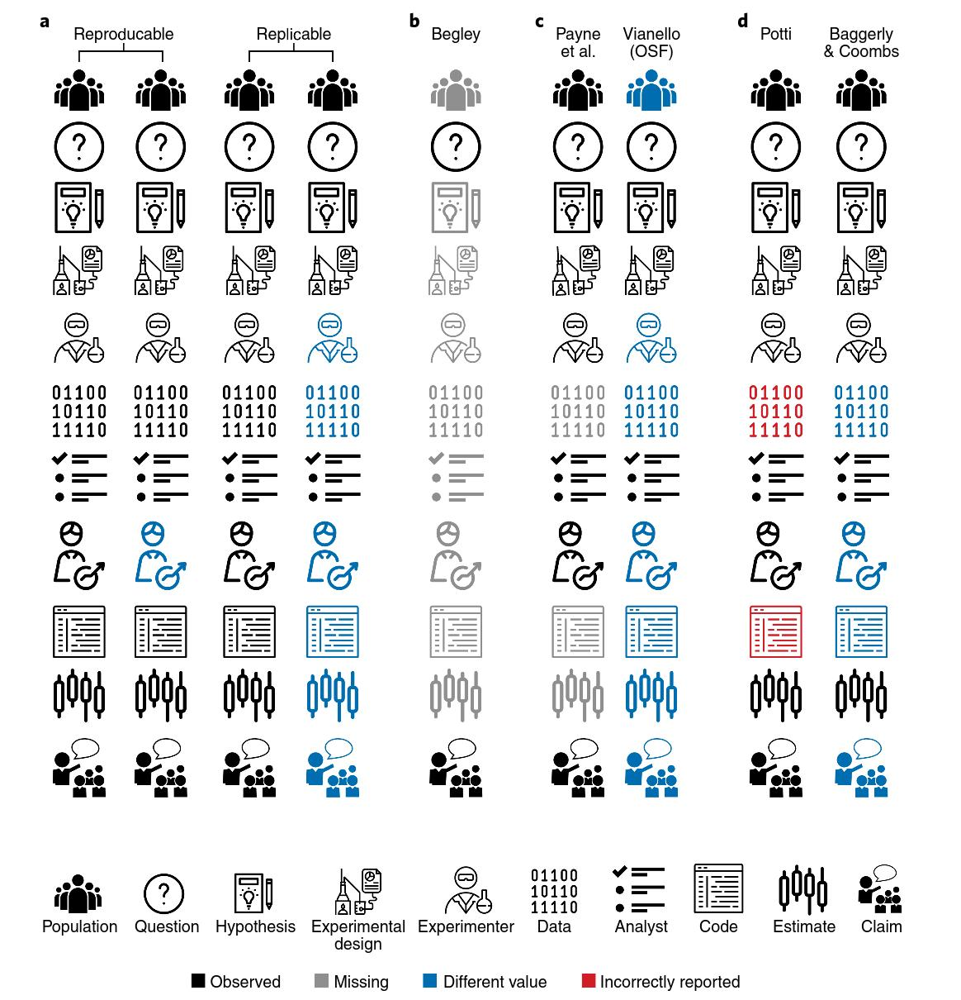
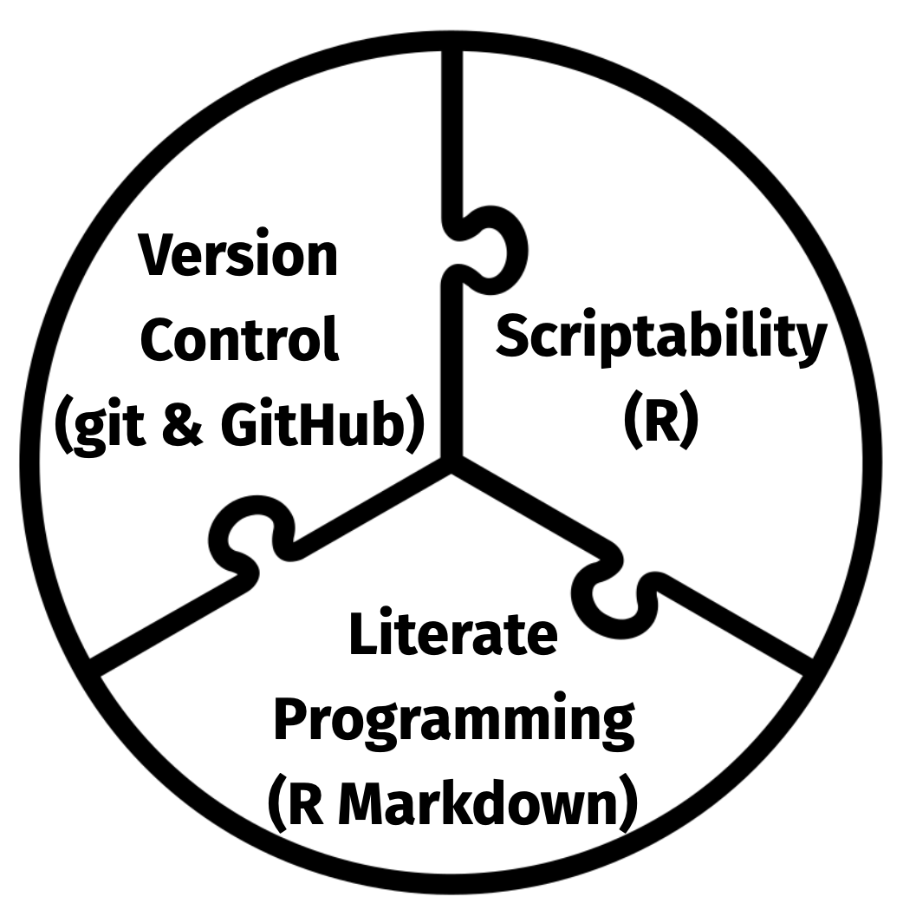
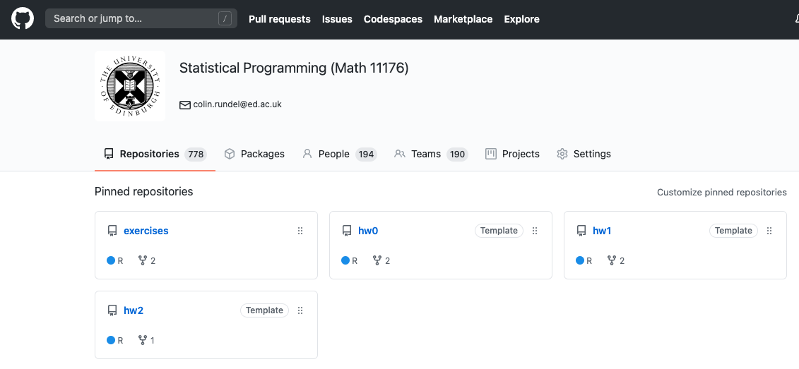
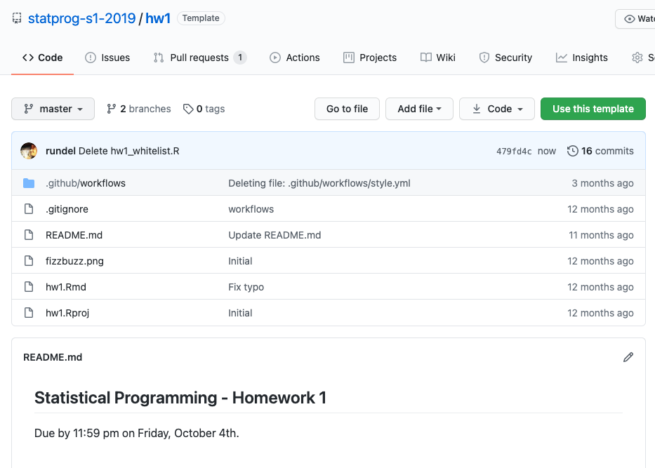
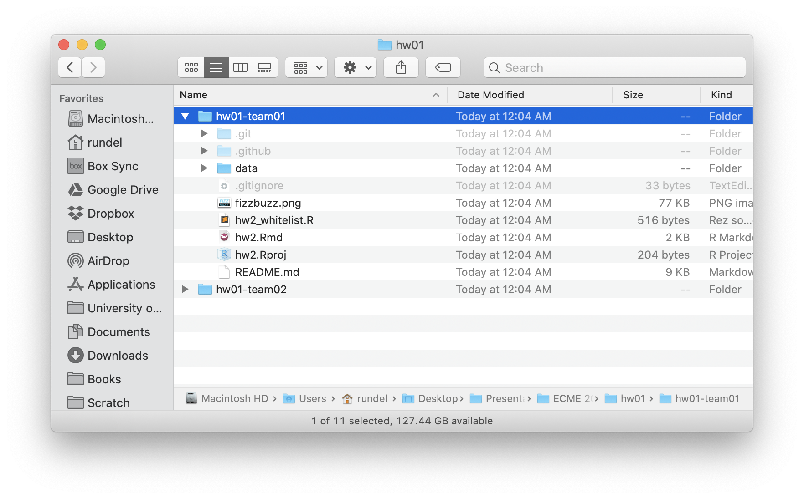
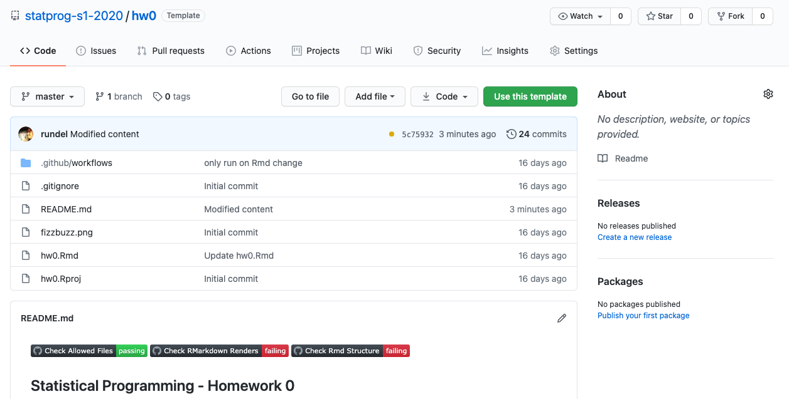
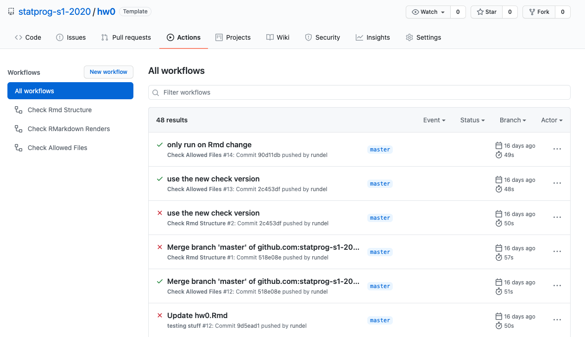
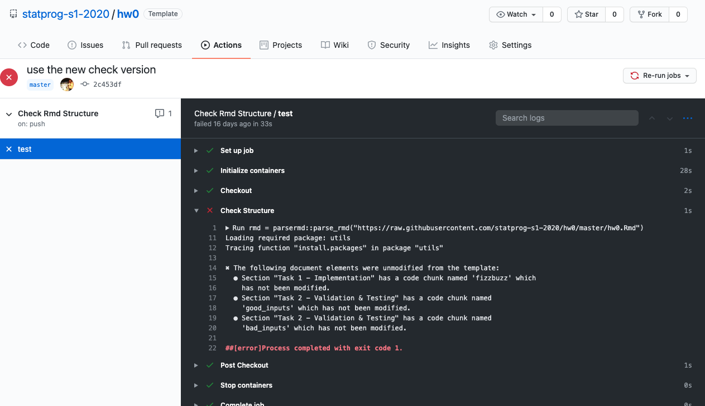

exclude: true

```{r setup, message=FALSE, warning=FALSE, include=FALSE}
knitr::opts_chunk$set(cache = TRUE)

#old_hooks = fansi::set_knit_hooks(knitr::knit_hooks)
#options(crayon.enabled = TRUE)

library(ghclass)
library(dplyr)
```

```{r cleanup, include = FALSE}
repo_delete(org_repos("ghclass-demo"), prompt = FALSE)
team_delete("ghclass-demo", org_teams("ghclass-demo"), prompt = FALSE)
org_remove("ghclass-demo", org_members("ghclass-demo", include_admins = FALSE), prompt = FALSE)
```

```{r student_pats, include = FALSE}
enc = readRDS("~/Desktop/Projects/ghclass/credentials/example_users.enc.rds")
key = sodium::sha256(charToRaw(Sys.getenv("GHCLASS_PAT")))
pats = unserialize( sodium::data_decrypt(enc, key) )
```

```{r add_students, include = FALSE}
user = c("ghclass-anya", "ghclass-bruno", "ghclass-celine", "ghclass-diego")
ghclass::org_invite(org = "ghclass-demo", user = user)
ghclass:::org_accept_invite("ghclass-demo", names(pats), pats)
```

---
class: title_bg

.title[
Teaching computing<br/>using git and GitHub
]

.conference[
  .name[ 
    TALMO, Sept 2020 
  ]
  .bitly[ 
    http://bit.ly/talmo_rundel
  ] 
]

.author[
.name[
Dr. Colin Rundel
]
.school[
Univ of Edinburgh
]
]

---
class: middle, center

# Teaching Reproducible Workflows

---

## Reproducible vs Replicable

```{r echo=FALSE, out.width="50%", fig.align="center"}

```

.footnote[
Source: Patil, Peng, Leek (2019) A visual tool for defining reproducibility and replicability. <i>Nature Human Behaviour</i>
]

---

## Reproducibility in practice

<br/>

- Can you recreate the tables and figures reproducible from the code and data?

- Does the code actually do what you think it does?

- In addition to what was done, is it clear *why* it was done? (e.g. how were hyper / tuning parameters chosen?)

- Can the code be used for other data?

- Can you hand the code off to someone else and expect it to work?

---

## Core pieces

```{r echo=FALSE, fig.align="center", out.width="50%"}

```

---

## Context

* I am the course organizer for Math 11176 - Statistical Programming
  * Course with ~200 Maths MSC students enrolled

* 100% coursework, multiple marked assignments (individual and team based)

* For each assignment we distribute:
  * Instruction document
  * Template `Rmd` for solutions
  * Data and other support files
  
* Need to collect: 
  * Completed template `Rmd`
  * Rendered output (`pdf`, `html`, `md`, etc.) 

---

## GitHub Organization

* 1 organization / course

* Students are added (anonymously) members of the organization

* 1 template repository / assignment

* 1 private repository / assignment / (team | individual)

* Automate the distribution, collection, and feedback using GitHub's API (`ghclass`)


---

## GitHub Organization

```{r echo=FALSE, out.width="100%", fig.align="center"}

```

---

## Template Example - hw1

```{r echo=FALSE, out.width="80%", fig.align="center"}

```

---

## `ghclass`

An R package that enables instructors to automate the management of courses on GitHub.

Key features:

- Repository creation, mirroring, updating, collecting, etc.

- Organization management (members, teams, etc.)

- Summary statistics (e.g. commits) by repo or over the org

- Many other common tasks (issues, PR, etc.)


For more details see the package website - https://rundel.github.io/ghclass/

---

## Creating a team assignment

```{r assignment}
org_create_assignment(
  org = "ghclass-demo", 
  repo = c("hw01-team01", "hw01-team01", "hw01-team02", "hw01-team02"),
  user = c("ghclass-anya", "ghclass-bruno", "ghclass-celine", "ghclass-diego"),
  team = c("hw01-team01", "hw01-team01", "hw01-team02", "hw01-team02"),
  source_repo = "statprog-s1-2019/hw1"
)
```

---

## Collecting student work

```{r clean-clone, include=FALSE}
unlink("hw01", recursive = TRUE)
```

```{r clone}
local_repo_clone(repo = org_repos(org = "ghclass-demo", "hw01-"), 
                 local_path = "hw01")
```

--

```{r echo=FALSE, out.width="65%", fig.align="center"}

```

---

## Contributor statistics

```{r contribs}
repo_contributors(repo = "statprog-s1-2019/hw02-lab01-team03") %>% 
  mutate(username = LETTERS[1:4]) %>%
  arrange(desc(commits))

repo_contributors(repo = "statprog-s1-2019/hw02-lab01-team10") %>%
  mutate(username = LETTERS[12+1:5]) %>%
  arrange(desc(commits))
```

---

## Automated feedback

```{r echo=FALSE, out.width="100%", fig.align="center"}

```


---

## Automated feedback

```{r echo=FALSE, out.width="100%", fig.align="center"}

```


---

## Automated feedback

```{r echo=FALSE, out.width="100%", fig.align="center"}

```


---

## Related ongoing work

* Peer evaluation (Mine Cetinkaya-Rundel and Therese Anders)

* Simplifying the automated feedback process:

    * `checklist` - R package for simplifying automated checks <br/> https://github.com/rundel/checklist

    * `parsermd` - R package for programmatic interaction with R markdown documents <br/> https://rundel.github.io/parsermd/ 
    
---

## Additional Resources

* [Happy Git and GitHyb for the useR](https://happygitwithr.com/) <br/> Jenny Bryan, Jim Hester

* [Excuse me, do you have a moment to talk about version control?](https://peerj.com/preprints/3159/) <br/> Jenny Bryan (2018), *The American Statistician*.

* [Using GitHub Classroom To Teach Statistics](https://www.tandfonline.com/doi/full/10.1080/10691898.2019.1617089) <br/> Jacob Fiksel, Leah Jager, Johannna Hardin, and Margaret Taub (2019), <br/>
*Journal of Statistics Education*.

* [Implementing version control with Git as a learning objective in statistics courses](https://arxiv.org/abs/2001.01988) <br/> Matthew Beckman, Mine Çetinkaya-Rundel, Nicholas Horton, Colin Rundel, Adam Sullivan, Maria Tackett (2020), *Journal of Statistics Education (in review)*

---

# Thank you!

.middle[ .center[

<div style="width: 98%">
<table class="contact" style="text-align: left; margin-left:auto; margin-right:auto; width:50%;">
<tbody>
<tr><td><br/></td><td>&nbsp;&nbsp;&nbsp;</td></tr>
<tr>
  <td style="vertical-align: middle;"> <i class="fas fa-envelope fa-fw fa-2x"></i> </td>
  <td></td>
  <td> 
    <a href="mailto:rundel@gmail.com">rundel@gmail.com</a>
  </td>
</tr>
<tr><td><br/></td></tr>
<tr>
  <td style="vertical-align: middle;"> <i class="fab fa-twitter-square fa-fw fa-2x"></i> </td>
  <td></td>
  <td> 
    <a href="https://twitter.com/rundel">@rundel</a>
  </td>
</tr>
<tr><td><br/></td></tr>
<tr>
  <td style="vertical-align: middle;"> <i class="far fa-file-powerpoint fa-fw fa-2x"></i> </td>
  <td></td>
  <td> 
      <a href="http://bit.ly/talmo_rundel">bit.ly/JSM2020_Sta444</a>
  </td>
</tr>
<tr><td><br/></td></tr>
<tr>
  <td style="vertical-align: middle;"> <i class="fas fa-chalkboard-teacher fa-fw fa-2x"></i> </td>
  <td></td>
  <td> 
    <a href="https://statprog-s1-2019.github.io/">statprog-s1-2019.github.io/</a>
  </td>
</tr>
</tbody>
</table>
</div>
] ]