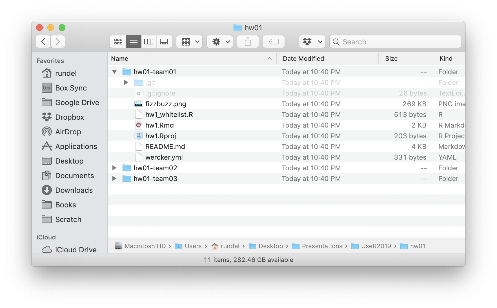

exclude: true

```{r setup, message=FALSE, warning=FALSE, include=FALSE}
fansi::set_knit_hooks(knitr::knit_hooks)
options(crayon.enabled = TRUE)

knitr::opts_chunk$set(cache = TRUE)

library(ghclass)
```

```{r cleanup, include = FALSE}
repo_delete(org_repos("ghclass-demo"), prompt = FALSE)
team_delete("ghclass-demo", org_teams("ghclass-demo"), prompt = FALSE)
org_remove("ghclass-demo", org_members("ghclass-demo", include_admins = FALSE), prompt = FALSE)
unlink("hw01/", TRUE, TRUE)
```

```{r student_pats, include = FALSE}
enc = readRDS("~/Desktop/Projects/ghclass/credentials/example_users.enc.rds")
key = sodium::sha256(charToRaw(Sys.getenv("GHCLASS_PAT")))
pats = unserialize( sodium::data_decrypt(enc, key) )
```

---
class: title_bg

.title[
ghclass
]

.subtitle[
an R package for managing classes with GitHub
]


.conference[
UseR!2019 &middot; Toulouse
]

.author[
.name[
Colin Rundel
]
.school[
Univ of Edinburgh &middot;
Duke Univ
]
]

---
background-image: url("imgs/workflow.001.jpeg")
background-position: center
background-size: contain

---
background-image: url("imgs/workflow.002.jpeg")
background-position: center
background-size: contain

---
background-image: url("imgs/workflow.003.jpeg")
background-position: center
background-size: contain

---
background-image: url("imgs/github_org.jpeg")
background-position: center
background-size: contain

---

## Setup

1. Signup for a GitHub Account - [github.com]()

2. Setup git and get a GitHub personal access token (PAT) - [github.com/settings/tokens](https://github.com/settings/tokens)
  - Need help? Read [usethis setup vignette](https://usethis.r-lib.org/articles/articles/usethis-setup.html) or [happy git with R](https://happygitwithr.com/)

3. Signup for the GitHub Education Discount - [education.github.com/benefits](https://education.github.com/benefits)

4. Create a GitHub Organization for your class - [github.com/organizations/new](https://github.com/organizations/new)

<br/>

.center[
Only step 4 needs to be repeated for a new class!
]

---

## Introduction to `ghclass`

```{r fake_install, eval = FALSE}
remotes::install_github("rundel/ghclass")
library(ghclass)
```

--

<br/>

Some design principals behind this package:

1. All of the package's functions are prefixed with either `org`, `repo`, `team`, `github` or `local_repo` to indicate what they operate on.

2. Most functions are vectorized over their parameters, to allow related operations to be grouped.

3. All messaging is built on `usethis::ui_`* functions, as such you can make it shutup with `options(usethis.quiet = TRUE)`.

4. Most actions are non-destructive and/or backed by git, the handful of dangerous operations will warn you.

---

## Org & Roster

Today we will be using [ghclass-demo](https://github.com/ghclass-demo) as our example, hopefully your Org has a slightly more informative name .

--

.center[
(I find `course#`-`semster` works well, e.g. `Sta323-Sp19`).
]

--

<br/><br/>

```{r roster, message = FALSE}
(roster = readr::read_csv("files/roster.csv"))
```

---
background-image: url("imgs/01_github_empty.png")
background-position: center
background-size: contain

---

## Checking your git config

```{r sitrep}
usethis::git_sitrep()
```

---

## Checking your git config -  `ghclass`

```{r good_token}
github_test_token()
```

--

```{r bad_token}
github_test_token("bad token")
```

---

## Inviting Students

```{r invite}
org_invite(org = "ghclass-demo", user = roster$github)
```

--

```{r status1-1}
org_members("ghclass-demo", include_admins = FALSE)
```

```{r status1-2}
org_pending_members("ghclass-demo")
```

---
background-image: url("imgs/02_github_members.png")
background-position: center
background-size: contain

---
background-image: url("imgs/03_github_pending.png")
background-position: center
background-size: contain

---

## A few days later ...

```{r accept1, include = FALSE}
ghclass:::org_accept_invite("ghclass-demo", names(pats)[1:4], pats[1:4])
```

```{r status2-1}
org_members("ghclass-demo", include_admins = FALSE)
```

```{r status2-2}
org_pending_members("ghclass-demo")
```

--

## several emails and a week later  ...

```{r accept2, include = FALSE}
ghclass:::org_accept_invite("ghclass-demo", names(pats)[5:6], pats[5:6])
```

```{r status3-1}
org_members("ghclass-demo", include_admins = FALSE)
```

--

```{r status3-2}
org_pending_members("ghclass-demo")
```

---
background-image: url("imgs/04_github_accepted.png")
background-position: center
background-size: contain

---

## Setup Teams

```{r}
roster
```

--

```{r teams}
team_create("ghclass-demo", team = roster$hw01)
```

--

```{r team_invite}
team_invite("ghclass-demo", user = roster$github, team = roster$hw01)
```
---
background-image: url("imgs/05_github_org_teams.png")
background-position: center
background-size: contain

---
background-image: url("imgs/06_github_teams.png")
background-position: center
background-size: contain

---

## Setup Repos

```{r repos1}
roster$hw01
```

--

```{r repos2}
repo_create("ghclass-demo", name = roster$hw01)
```

--

```{r repos3}
repo_add_team(repo = org_repos("ghclass-demo", filter = "hw01-"), 
              team = org_teams("ghclass-demo", filter = "hw01-"))
```

---
background-image: url("imgs/07_github_repos.png")
background-position: center
background-size: contain

---
background-image: url("imgs/08_github_repo_empty.png")
background-position: center
background-size: contain

---

## Provide Template Code

```{r mirror1}
(repos = org_repos("ghclass-demo", filter = "hw01-"))
```

--

```{r mirror2}
repo_mirror(source_repo = "Sta323-Sp19/hw1", 
            target_repo = repos)
```

---
background-image: url("imgs/09_github_mirrored.png")
background-position: center
background-size: contain

---
background-image: url("imgs/10_github_readme1.png")
background-position: center
background-size: contain

---

## Save some steps

```{r assignment}
org_create_assignment(org = "ghclass-demo", repo = roster$hw02, user = roster$github, 
                      team = roster$hw02, source_repo = "Sta323-Sp19/hw2")
```

---

## Individual assignments (e.g. exams)

```{r exam}
org_create_assignment(org = "ghclass-demo", repo = paste0("exam1-", roster$github),
                      user = roster$github, source_repo = "Sta323-Sp19/midterm1")
```

---

## Making Changes

```{r add_file}
repo_add_file(repo = org_repos("ghclass-demo", "hw01-"),
              file = "files/fizzbuzz.png")
```

```{r add_file2}
repo_add_file(repo = org_repos("ghclass-demo", "hw01-"),
              file = "files/fizzbuzz.png", overwrite = TRUE)
```

---

## Modify a file

```{r modify_file}
repo_modify_file(repo = org_repos("ghclass-demo", "hw01-"), file = "README.md",
                 pattern = "on Thursday 1/24/2019.", content = "on Wednesday 10/07/2019.")
```

---
background-image: url("imgs/10_github_readme1.png")
background-position: center
background-size: contain

---
background-image: url("imgs/11_github_readme2.png")
background-position: center
background-size: contain

---
background-image: url("imgs/12_github_readme3.png")
background-position: center
background-size: contain

---

## Collect student work

```{r clone}
local_repo_clone(repo = org_repos("ghclass-demo", "hw01-"), local_path = "hw01")
```

--

```{r echo=FALSE, out.width="65%", fig.align="center"}

```


---

## Feedback?

```{r student_code, include=FALSE}
repo_add_file("ghclass-demo/hw01-team01", file = "files/hw1.Rmd", overwrite = TRUE)
```

```{r style}
repo_style("ghclass-demo/hw01-team01", files = "*.Rmd", draft = TRUE)
```


```{r cleanup2, ref.label = 'cleanup', include = FALSE}
```

---
background-image: url("imgs/13_github_pull_req.png")
background-position: center
background-size: contain

---
background-image: url("imgs/14_github_diff.png")
background-position: center
background-size: contain


---

## Future Work

* We will be submitting to CRAN in the next month

* Active summer project adding functionality for peer review by Mine Cetinkaya-Rundel and Therese Anders

* Support for GitHub actions for automated feedback ([rundel/wercker](https://github.com/rundel/wercker) replacement)

* Support more workflows, if you GitHub based workflow for teaching that was not reflected here please get in touch.

---

---

# Thank you!

.middle[ .center[

<table class="contact" style="width: 50%; text-align: left; font-size: 120%;">
<tbody>
<tr>
  <td style="vertical-align: middle;"> <i class="fas fa-envelope fa-fw fa-3x"></i> </td>
  <td> 
    <a href="mailto:rundel@gmail.com">rundel@gmail.com</a>
  </td>
</tr>
<tr>
  <td style="vertical-align: middle;"> <i class="fab fa-github-square fa-fw fa-3x"></i> </td>
  <td> 
    <a href="https://github.com/rundel">github.com/rundel</a>
  </td>
</tr>
<tr>
  <td style="vertical-align: middle;"> <i class="fab fa-twitter-square fa-fw fa-3x"></i> </td>
  <td> 
    <a href="https://twitter.com/rundel">@rundel</a>
  </td>
</tr>
<tr>
  <td style="vertical-align: middle;"> <i class="far fa-file-powerpoint fa-fw fa-3x"></i> </td>
  <td> 
      <a href="http://github.com/rundel/Presentations">rundel/Presentations/UseR2019</a>
  </td>
</tr>
</tbody>
</table>

] ]
